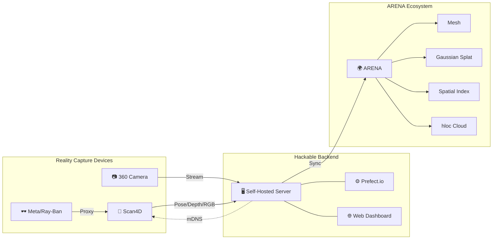
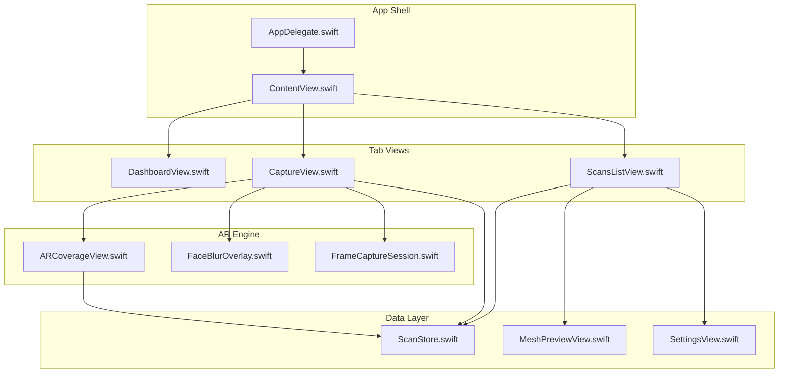
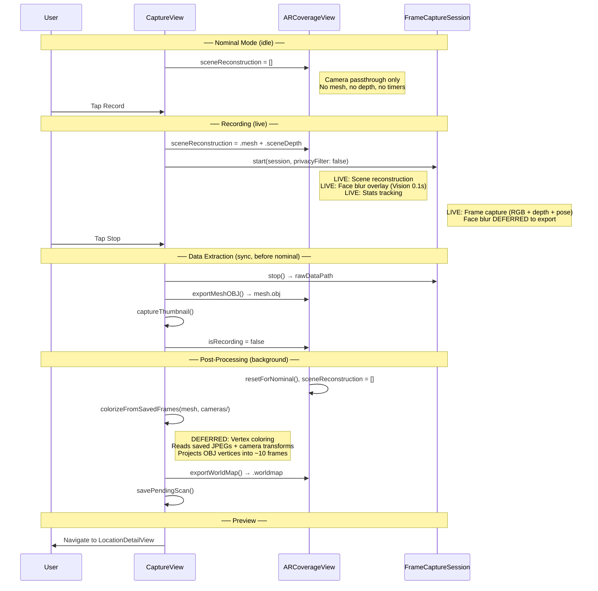
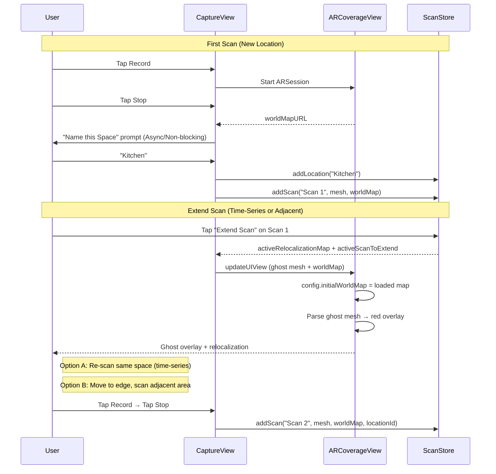
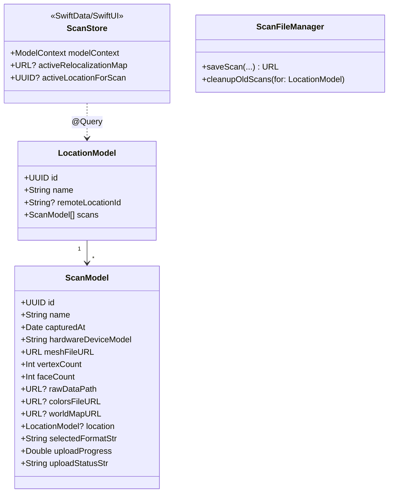

# Scan4D — Requirements & Architecture Reference

> **Purpose:** This is the single source of truth for feature requirements, architecture, and implementation status of the Scan4D application. It is designed to be consumed by both humans and AI coding assistants to maintain context across development sessions.
>
> **Maintainer note:** When adding a feature, update the relevant section below _and_ the corresponding entry in [README.md](README.md). When modifying architecture, update the diagrams and source links.

---

## System Context

Scan4D is a time-series reality capture application built on the WiSEScan research platform. It captures RGB, pose, and (on LiDAR-equipped devices) mesh and depth data. Non-LiDAR devices operate in **Lite Mode**, capturing images and camera poses for server-side photogrammetry. It can operate standalone (local capture + export) or connect to a self-hosted backend for orchestrated reconstruction pipelines.

**Related docs:**
- [Platform Architecture](../wiselab-scan/ARCHITECTURE.md) — Full system design
- [PlantUML Diagram](../wiselab-scan/wisescan-architecture.puml) — Rendered system diagram
- [iOS Design Spec](Design/DESIGN.md) — Original UI/UX design document

---

## iOS App Architecture

### Source File Index

| File | Role | Key Types / Functions |
|:-----|:-----|:----------------------|
| [AppDelegate.swift](wisescan-ios/AppDelegate.swift) | App lifecycle, splash screen | `AppDelegate` |
| [ContentView.swift](wisescan-ios/ContentView.swift) | Root TabView, LiDAR check, Developer Mode banner | `ContentView`, `hasLiDAR`, `developerMode` |
| [DashboardView.swift](wisescan-ios/DashboardView.swift) | Server status, wearable pairing | `DashboardView` |
| [CaptureView.swift](wisescan-ios/CaptureView.swift) | Live capture UI, recording, Scan4D naming, capacity HUD, flip camera | `CaptureView`, `startRecording()`, `stopRecording()`, `savePendingScan()` |
| [ARCoverageView.swift](wisescan-ios/ARCoverageView.swift) | ARKit session, mesh export | `ARCoverageView`, `Coordinator`, `exportMeshOBJ()`, `exportWorldMap()` |
| [FaceBlurOverlay.swift](wisescan-ios/FaceBlurOverlay.swift) | Live face detection + blur for exports | `FaceBlurOverlay`, `FaceBlurUtil.blurFaces()` |
| [FrameCaptureSession.swift](wisescan-ios/FrameCaptureSession.swift) | RAW data capture (RGB, depth, poses) | `FrameCaptureSession`, `start()`, `stop()`, `writeTransformsJSON()`, `writePolycamCameras()` |
| [ScansListView.swift](wisescan-ios/ScansListView.swift) | Scan cards, location groups, rename, upload | `ScansListView`, `ScanCard` |
| [MeshPreviewView.swift](wisescan-ios/MeshPreviewView.swift) | SceneKit 3D preview with vertex colors | `MeshPreviewView` |
| [ScanStore.swift](wisescan-ios/ScanStore.swift) | Data models, location hierarchy, capacity scoring | `ScanStore`, `ScanLocation`, `CapturedScan`, `ScanStats`, `capacityScore` |
| [MeshConverter.swift](wisescan-ios/MeshConverter.swift) | OBJ→PLY and OBJ→USDZ mesh conversion | `MeshConverter.objToPLY()`, `MeshConverter.objToUSDZ()` |
| [SettingsView.swift](wisescan-ios/SettingsView.swift) | Upload URL, RAW settings, Developer Mode, in-app guide | `SettingsView`, `developerMode`, `flipCameraEnabled` |

---

## Feature Requirements

### REQ-001: LiDAR Mesh Capture
| | |
|:--|:--|
| **Status** | ✅ Complete |
| **Description** | Real-time scene reconstruction using ARKit `ARWorldTrackingConfiguration` with `.mesh` scene reconstruction. Live wireframe overlay via `showSceneUnderstanding`. Only enabled on LiDAR-equipped devices (`ARCoverageView.supportsLiDAR`). |
| **Source** | [ARCoverageView.swift](wisescan-ios/ARCoverageView.swift) — `makeUIView()`, `supportsLiDAR` |
| **Dependencies** | LiDAR hardware (runtime-detected), iOS 17+ |

### REQ-001b: Lite Mode (No LiDAR)
| | |
|:--|:--|
| **Status** | ✅ Complete |
| **Description** | Non-LiDAR devices (iPhone 16, older iPads) run in Lite Mode: camera passthrough + image/pose capture for server-side photogrammetry. No mesh, depth, coverage overlay, or 3D face anchors. A blue "Lite Mode" banner is shown in CaptureView. ContentView shows an informational alert on launch. |
| **Source** | [ARCoverageView.swift](wisescan-ios/ARCoverageView.swift) — `supportsLiDAR`, [CaptureView.swift](wisescan-ios/CaptureView.swift) — lite mode banner, [FrameCaptureSession.swift](wisescan-ios/FrameCaptureSession.swift) — optional depth |
| **Dependencies** | ARKit (required), LiDAR (optional) |

### REQ-002: Start/Stop Recording
| | |
|:--|:--|
| **Status** | ✅ Complete |
| **Description** | Tap to start scanning with timer, tap again to stop and save. Capture view starts in **nominal mode** (camera passthrough only, no scene reconstruction). Recording activates full AR processing (mesh overlay, depth capture, capacity tracking). Stopping or leaving the view silently resets to nominal mode. Auto-stop on view disappear. |
| **Source** | [CaptureView.swift](wisescan-ios/CaptureView.swift) — `startRecording()`, `stopRecording()`, `.onDisappear` |

#### Capture Lifecycle: Nominal → Recording → Post-Processing → Preview

### REQ-003: Scan4D (Extend Scan — Time-Series & Adjacent Stitching)
| | |
|:--|:--|
| **Status** | ✅ Complete (Phase 1 — Local) |
| **Description** | Enable two complementary scanning workflows via a single "Extend Scan" button, both powered by `ARWorldMap` relocalization and a ghost-mesh overlay. Provide conditional UI for specific capture sources. |
| **Details** | **Use Case 1 — Time-Series Re-Scan:** Scan the same space again at a later time. The red ghost overlay shows the original capture area; the user re-scans the identical region. The backend pipeline can diff or merge these scans to track changes over time. **Use Case 2 — Adjacent-Space Stitching:** Extend a scan into an adjacent area. The user moves to the edge of the red ghost overlay and begins recording, overlapping slightly with the previous scan. The backend pipeline stitches the chunks together (via COLMAP, RealityCapture, or ICP) to build a single unified model from multiple adjacent sessions. Both use cases share identical device-side mechanics: (1) **Relocalization Setup:** Tapping "Extend Scan" on any scan card loads that scan's `ARWorldMap` as the AR session initialization target. (2) **Ghost Visualization:** The selected scan's mesh renders as a 0.3-opacity red overlay (`UnlitMaterial`). (3) **UI Prompting:** A dismissable toast instructs the user to either re-scan the red region (time-series) or move to its edge (adjacent stitching). (4) **Session Stability:** Destructive configurations like `.resetTracking` are strictly bypassed, guaranteeing that the ghost overlay anchors flawlessly without natively drifting out of phase between clips. (5) **Server-Side Focus:** No on-device mesh merging. The backend receives individual chunked scans with shared ARKit coordinate frames, visual overlap, and raw image data for downstream alignment. (6) **Wearables Constraint:** The "Extend Scan" functionality is explicitly disabled in the UI for proxy scans (e.g., Meta Ray-Ban glasses) because they lack ARKit spatial localization capabilities to place a ghost overlay or track device motion natively. |

### REQ-004: Privacy Filtering
| | |
|:--|:--|
| **Status** | ✅ Complete |
| **Description** | Person segmentation removes humans from mesh. Face detection blurs faces live and in exports. Detected 2D bounding boxes are unprojected against the 16-bit depth buffer to dynamically cluster `[SIMD3]` markers representing captured human heads. These `face_anchors` bypass mesh inclusion and orbit the final preview mesh as red indicators before the server deletes the bodies downstream. Depth maps zero out person regions. Persistent toggle via `@AppStorage`. |
| **Source** | [ARCoverageView.swift](wisescan-ios/ARCoverageView.swift) — `privacyFilter`, person segmentation · [FaceBlurOverlay.swift](wisescan-ios/FaceBlurOverlay.swift) — `detectFaces()`, `FaceBlurUtil.blurFaces()` · [FrameCaptureSession.swift](wisescan-ios/FrameCaptureSession.swift) — privacy-aware frame capture |

### REQ-005: 3D Scan Preview
| | |
|:--|:--|
| **Status** | ✅ Complete |
| **Description** | Interactive SceneKit preview. Uses camera-sampled vertex coloring optimized with a dynamic 150-frame capacity and a precise 150mm *Depth Occlusion Culling* threshold to prevent color bleeding through walls. Parses `scan4d_metadata.json` to spawn 3D Privacy Markers. Falls back to height-gradient coloring. |
| **Source** | [MeshPreviewView.swift](wisescan-ios/MeshPreviewView.swift) · [ARCoverageView.swift](wisescan-ios/ARCoverageView.swift) — `VertexColorAccumulator` |

### REQ-006: Export Formats & Backend Ingestion
| | |
|:--|:--|
| **Status** | ✅ Complete |
| **Description** | Each export format includes only the data relevant to that format. Scan4D bundles metadata + relocalization + Polycam payload. Polycam exports raw import data. RAW exports Nerfstudio-compatible poses. OBJ exports the raw mesh file. PLY and USDZ are converted from OBJ on-device via `MeshConverter`. |
| **Source** | [ARCoverageView.swift](wisescan-ios/ARCoverageView.swift) — `exportMeshOBJ()` · [FrameCaptureSession.swift](wisescan-ios/FrameCaptureSession.swift) — `writeTransformsJSON()` · [ScansListView.swift](wisescan-ios/ScansListView.swift) — `prepareExport()` · [MeshConverter.swift](wisescan-ios/MeshConverter.swift) — `objToPLY()`, `objToUSDZ()` |

### REQ-007: Save & Upload
| | |
|:--|:--|
| **Status** | ✅ Complete |
| **Description** | Save to Files via share sheet. HTTP PUT upload to configurable URL with status tracking (pending → uploading → success/failed). ZIP packaging for RAW/Polycam. |
| **Source** | [ScansListView.swift](wisescan-ios/ScansListView.swift) — `ScanCard`, `uploadScan()`, `saveToFiles()` |

### REQ-008: Server Status & Settings
| | |
|:--|:--|
| **Status** | ✅ Complete |
| **Description** | Dashboard shows server reachability via HTTP HEAD. Settings for upload URL, overlap %, blur rejection. In-app workflow guide. |
| **Source** | [DashboardView.swift](wisescan-ios/DashboardView.swift) · [SettingsView.swift](wisescan-ios/SettingsView.swift) |

### REQ-009: Scan Capture Data
| | |
|:--|:--|
| **Status** | ✅ Complete |
| **Description** | Adaptive-rate RGB frames (JPEG), 16-bit depth maps (PNG, mm), and camera poses. Overlap-based frame selection with motion blur rejection and real-time centered UI toast warnings for excessive motion. Features a fully isolated sequential `ioQueue` guaranteeing 1:1 parity between image, depth, and transform JSON drops natively bypassing async races. |
| **Source** | [FrameCaptureSession.swift](wisescan-ios/FrameCaptureSession.swift) — `captureFrame()`, `cameraMovement()` |

### REQ-010: Coverage Overlay
| | |
|:--|:--|
| **Status** | 🗑️ Removed |
| **Description** | Originally a 2D overlay using anchor bounding-box convex hulls and negative masking with a tiled image pattern. This feature and its assets (`CoverageMask`) were entirely removed to simplify the codebase in favor of native LiDAR mesh visualizing. |
| **Source** | N/A |
| **Assets** | N/A |

### REQ-011: Persistent Scan Storage
| | |
|:--|:--|
| **Status** | ✅ Complete |
| **Description** | SwiftData/SQLite for on-disk location and lightweight scan metadata. Binary assets are saved directly to file URLs on disk. |
| **Source** | [ScanStore.swift](wisescan-ios/ScanStore.swift) — `ScanFileManager`, `@Model ScanLocation`, `@Model CapturedScan` |

### REQ-012: Map Stitching and Coverage
**Description:** Prevent localized mesh limits from capping scan size by supporting both time-series re-scans and adjacent spatial mapping.

**Details:**
- There is no upper limit on how many scans can exist inside a single Location. Users are encouraged to either re-scan the same space at different times (for time-series analysis) or chop up large environments (like multi-room offices) into several overlapping adjacent sessions.
- **Dual Workflow Support:** "Extend Scan" supports both re-scanning an existing area and extending into new adjacent areas. The backend pipeline determines whether to treat the scans as temporal updates or spatial extensions based on overlap and metadata.
- **Unbounded Local Storage:** The "Keep Last 2" local storage retention limit has been removed, as all scans in a chain are required to reconstruct a complete master scene. Scans must be deleted manually by the user or purged upon successful upload to the server.

### REQ-013: Developer Mode
| | |
|:--|:--|
| **Status** | ✅ Complete |
| **Description** | Toggleable debugging section in Settings with persistent `@AppStorage` switches. Includes Flip Camera (front/back switching via `ARFaceTrackingConfiguration`), persistent orange banner across all tabs with tap-to-disable (auto-scrolls to Settings section). Camera auto-reverts to back when dev mode is disabled. |
| **Source** | [SettingsView.swift](wisescan-ios/SettingsView.swift) — `developerMode`, `flipCameraEnabled` · [ContentView.swift](wisescan-ios/ContentView.swift) — banner overlay · [CaptureView.swift](wisescan-ios/CaptureView.swift) — flip button · [ARCoverageView.swift](wisescan-ios/ARCoverageView.swift) — `ARFaceTrackingConfiguration` switching |

### REQ-014: Scan Capacity Metrics
| | |
|:--|:--|
| **Status** | ✅ Complete |
| **Description** | Live HUD showing polygon count, anchor count (~area), drift level, and session duration. Composite capacity score (0–1) using `max(polygonPressure, memoryPressure, anchorPressure, driftEstimate)`. Color-coded progress bar (green→yellow→red). Warning banners at >80% and >95% capacity. Memory tracks delta from session baseline, not absolute footprint. |
| **Source** | [ScanStore.swift](wisescan-ios/ScanStore.swift) — `ScanStats.capacityScore`, `currentMemoryUsageMB()` · [ARCoverageView.swift](wisescan-ios/ARCoverageView.swift) — `Coordinator.updateStats()`, drift tracking · [CaptureView.swift](wisescan-ios/CaptureView.swift) — redesigned HUD |
| **Design Doc** | [Scan4D_Architecture.md](Design/Scan4D_Architecture.md) — "Large-Space Scanning & Map Stitching" section |

### REQ-015: Location Rename
| | |
|:--|:--|
| **Status** | ✅ Complete |
| **Description** | In Edit mode, location group names become tappable (orange with pencil icon) to trigger a rename alert with text field. Saves directly to SwiftData. |
| **Source** | [ScansListView.swift](wisescan-ios/ScansListView.swift) — `showRenameAlert`, `locationToRename` |

### REQ-017: Wearable Proxy
| | |
|:--|:--|
| **Status** | ✅ Complete |
| **Description** | Proxy Mode Data Collection connects to Meta Ray-Ban glasses using the Meta Wearables DAT SDK. Connections are managed in the background via the dashboard's connection card. Listens for hardware shutter button presses to start/stop recordings and streams RGB frames natively into the app, eliminating the need for a WebRTC receiver loop. Includes a 15 FPS manual rate limiter to prevent massive proxy image bloat, strict frame-isolation by saving Wearable frames to a separate `proxy_images/` directory in the export payload, and an immediate session teardown mechanism when unregistering to prevent stale UI state. |
| **Source** | `MetaWearableManager.swift` (SDK Lifecycle) · `FrameCaptureSession.swift` (Frame Ingestion) · `ScansListView.swift` (Zipping/Export Management) |

---

## Planned Features

| ID | Feature | Description | Priority |
|:---|:--------|:------------|:---------|
| REQ-016 | Server Discovery | Detect local Prefect servers via mDNS/Bonjour | Medium |
| REQ-018 | Streaming Mode | Real-time lower-res tracking data to server | Medium |
| REQ-019 | Workflow Orchestration | Select preset server pipelines (Mesh, Splat, Spatial Indexing) | High |
| REQ-020 | Job Observability | Display remote Prefect job status locally | Medium |
| ~~REQ-021~~ | ~~Scan4D Ghost Overlay~~ | ✅ **Implemented** — Red translucent overlay renders previous scan during Extend Scan | — |
| REQ-022 | Scan4D Ground Truth Offset | Capture GPS or AprilTag data alongside scans for backend alignment seeding | High |
| REQ-023 | OpenFLAME Live Relocalization | Use backend server to stream visual localization back to device, bypassing ARKit maps | Low |
| ~~REQ-024~~ | ~~Large-Space Map Stitching~~ | ✅ **Implemented (client-side)** — Extend Scan supports adjacent chunking with shared coordinate frames; server-side alignment is a downstream concern | — |

---

## Data Model

**Source:** [ScanStore.swift](wisescan-ios/ScanStore.swift)

---

## Anchoring Strategy (Scan4D)

| Mechanism | Role | Reliability | Best Use |
|:----------|:-----|:------------|:---------|
| **Backend ICP Alignment** | **Ultimate Truth** | ⭐⭐⭐⭐ | High-fidelity historical alignment of point clouds/splats on the server. |
| **GPS / Anchor Tags** | **Ground Truth Seed**| ⭐⭐⭐⭐⭐ | Categorical offset to give the backend a starting guess before ICP. |
| **`ARWorldMap`** | **Edge UI Guide** | ⭐⭐ | Transient local caching to power the live "ghost overlay" UI during capture. |
| OpenFLAME | Server-Assisted UI | ⭐⭐⭐ | Future upgrade for live UI guiding, streaming visual features to backend. |
| RoomPlan API | Deprioritized | ⭐⭐⭐ | Apple-locked semantic tracking; better handled off-device by the server. |

**Current implementation:** `ARWorldMap` is saved categorically and used for Edge UI relocalization. See [Design/Scan4D_Architecture.md](Design/Scan4D_Architecture.md) for full rationale on the Backend-First philosophy.

---

## Export Format Reference

Each format includes only its own payload — no universal base.

| Format | Extension | Contents | Target Tool |
|:-------|:----------|:---------|:------------|
| Scan4D | `.zip` | `scan4d_metadata.json`, `relocalization.worldmap`, `images/`, `depth/`, `cameras/`, `mesh_info.json` | Scan4D server workflows |
| Polycam | `.zip` | `images/`, `depth/`, `cameras/`, `mesh_info.json` | Polycam raw data import |
| RAW | `.zip` | `images/`, `depth/`, `transforms.json` | Nerfstudio, COLMAP |
| OBJ | `.obj` | Single mesh file (no vertex colors) | MeshLab, Blender |
| PLY | `.ply` | Converted mesh with embedded vertex colors | MeshLab, CloudCompare |
| USDZ | `.usdz` | Converted mesh via ModelIO | iOS Quick Look |

---
