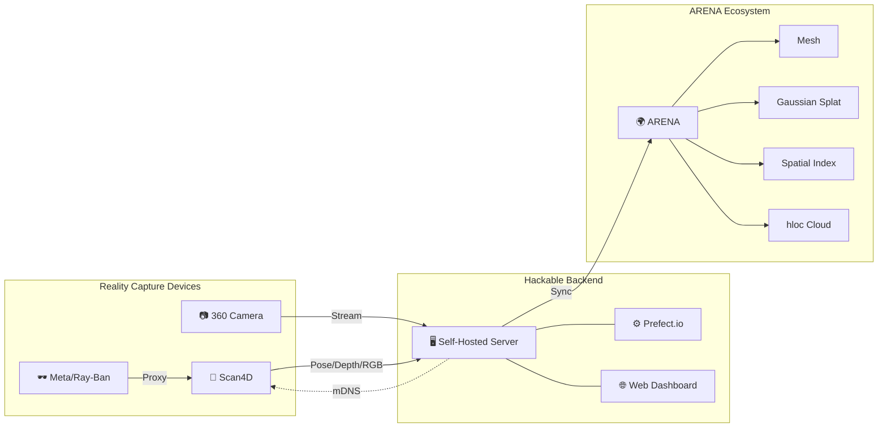
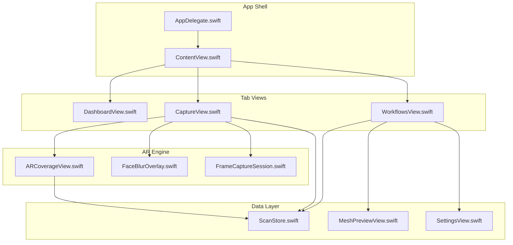
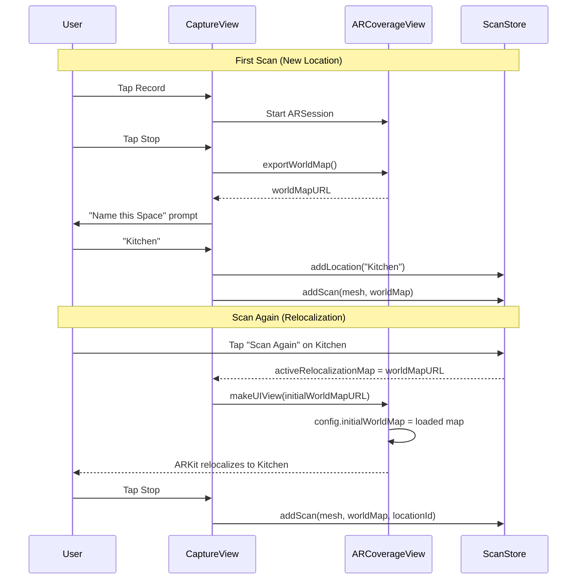
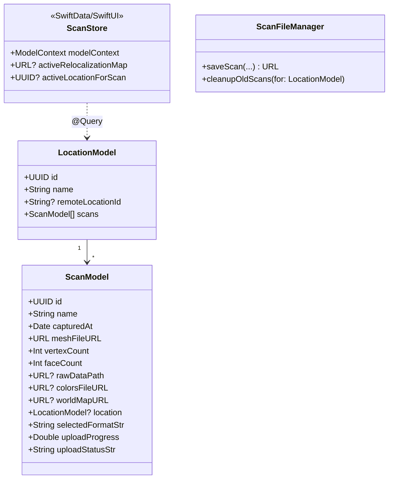

# Scan4D — Requirements & Architecture Reference

> **Purpose:** This is the single source of truth for feature requirements, architecture, and implementation status of the Scan4D application. It is designed to be consumed by both humans and AI coding assistants to maintain context across development sessions.
>
> **Maintainer note:** When adding a feature, update the relevant section below _and_ the corresponding entry in [README.md](README.md). When modifying architecture, update the diagrams and source links.

---

## System Context

Scan4D is a time-series reality capture application built on the WiSEScan research platform. It captures LiDAR mesh, RGB, depth, and pose data. It can operate standalone (local capture + export) or connect to a self-hosted backend for orchestrated reconstruction pipelines.

**Related docs:**
- [Platform Architecture](../wiselab-scan/ARCHITECTURE.md) — Full system design
- [PlantUML Diagram](../wiselab-scan/wisescan-architecture.puml) — Rendered system diagram
- [iOS Design Spec](Design/DESIGN.md) — Original UI/UX design document

---

## iOS App Architecture

### Source File Index

| File | Role | Key Types / Functions |
|:-----|:-----|:----------------------|
| [AppDelegate.swift](wisescan-ios/AppDelegate.swift) | App lifecycle, splash screen | `AppDelegate` |
| [ContentView.swift](wisescan-ios/ContentView.swift) | Root TabView, LiDAR check | `ContentView`, `hasLiDAR` |
| [DashboardView.swift](wisescan-ios/DashboardView.swift) | Server status, wearable pairing | `DashboardView` |
| [CaptureView.swift](wisescan-ios/CaptureView.swift) | Live capture UI, recording, Scan4D naming | `CaptureView`, `startRecording()`, `stopRecording()`, `savePendingScan()` |
| [ARCoverageView.swift](wisescan-ios/ARCoverageView.swift) | ARKit session, mesh export, coverage overlay | `ARCoverageView`, `Coordinator`, `CoverageOverlayView`, `exportMeshOBJ()`, `exportWorldMap()` |
| [FaceBlurOverlay.swift](wisescan-ios/FaceBlurOverlay.swift) | Live face detection + blur for exports | `FaceBlurOverlay`, `FaceBlurUtil.blurFaces()` |
| [FrameCaptureSession.swift](wisescan-ios/FrameCaptureSession.swift) | RAW data capture (RGB, depth, poses) | `FrameCaptureSession`, `start()`, `stop()`, `writeTransformsJSON()`, `writePolycamCameras()` |
| [WorkflowsView.swift](wisescan-ios/WorkflowsView.swift) | Scan cards, location groups, upload | `WorkflowsView`, `ScanCard` |
| [MeshPreviewView.swift](wisescan-ios/MeshPreviewView.swift) | SceneKit 3D preview with vertex colors | `MeshPreviewView` |
| [ScanStore.swift](wisescan-ios/ScanStore.swift) | Data models, location hierarchy | `ScanStore`, `ScanLocation`, `CapturedScan`, `ScanStats` |
| [SettingsView.swift](wisescan-ios/SettingsView.swift) | Upload URL, RAW settings, in-app guide | `SettingsView` |

---

## Feature Requirements

### REQ-001: LiDAR Mesh Capture
| | |
|:--|:--|
| **Status** | ✅ Complete |
| **Description** | Real-time scene reconstruction using ARKit `ARWorldTrackingConfiguration` with `.mesh` scene reconstruction. Live wireframe overlay via `showSceneUnderstanding`. |
| **Source** | [ARCoverageView.swift](wisescan-ios/ARCoverageView.swift) — `makeUIView()` |
| **Dependencies** | LiDAR hardware, iOS 17+ |

### REQ-002: Start/Stop Recording
| | |
|:--|:--|
| **Status** | ✅ Complete |
| **Description** | Tap to start scanning with timer, tap again to stop and save. Auto-stop on view disappear. |
| **Source** | [CaptureView.swift](wisescan-ios/CaptureView.swift) — `startRecording()`, `stopRecording()`, `.onDisappear` |

### REQ-003: Scan4D (Time-Series Scanning)
| | |
|:--|:--|
| **Status** | ✅ Complete (Phase 1 — Local) |
| **Description** | Group scans by named Location. Cache `ARWorldMap` per scan. "Scan Again" reloads the map for ARKit relocalization, aligning new scans to the same coordinate system. |
| **Source** | [ScanStore.swift](wisescan-ios/ScanStore.swift) — `ScanLocation`, `addLocation()`, `activeRelocalizationMap` · [CaptureView.swift](wisescan-ios/CaptureView.swift) — `savePendingScan()`, naming alert · [ARCoverageView.swift](wisescan-ios/ARCoverageView.swift) — `initialWorldMapURL`, `exportWorldMap()` |
| **Design Doc** | [Scan4D_Architecture.md](Design/Scan4D_Architecture.md) |
| **Future** | Ghost overlay of previous mesh, change detection highlighting, multi-device sync |

### REQ-004: Privacy Filtering
| | |
|:--|:--|
| **Status** | ✅ Complete |
| **Description** | Person segmentation removes humans from mesh. Face detection blurs faces live and in exports. Depth maps zero out person regions. Persistent toggle via `@AppStorage`. |
| **Source** | [ARCoverageView.swift](wisescan-ios/ARCoverageView.swift) — `privacyFilter`, person segmentation · [FaceBlurOverlay.swift](wisescan-ios/FaceBlurOverlay.swift) — `detectFaces()`, `FaceBlurUtil.blurFaces()` · [FrameCaptureSession.swift](wisescan-ios/FrameCaptureSession.swift) — privacy-aware frame capture |

### REQ-005: 3D Scan Preview
| | |
|:--|:--|
| **Status** | ✅ Complete |
| **Description** | Interactive SceneKit preview with camera-sampled vertex coloring or height-gradient fallback. |
| **Source** | [MeshPreviewView.swift](wisescan-ios/MeshPreviewView.swift) · [ARCoverageView.swift](wisescan-ios/ARCoverageView.swift) — `VertexColorAccumulator` |

### REQ-006: Export Formats & Backend Ingestion
| | |
|:--|:--|
| **Status** | ✅ Complete |
| **Description** | All exports (OBJ, PLY, USDZ, RAW, PLYCM) are packaged into a unified `.zip` archive. The archive includes the chosen payload along with `scan4d_metadata.json` (injecting a `"export_format"` key), and the `relocalization.worldmap`. The server uses the JSON to determine how to parse the ZIP. |
| **Source** | [ARCoverageView.swift](wisescan-ios/ARCoverageView.swift) — `exportMeshOBJ()` · [FrameCaptureSession.swift](wisescan-ios/FrameCaptureSession.swift) — `writeTransformsJSON()` · [WorkflowsView.swift](wisescan-ios/WorkflowsView.swift) — Unified PDF archiving |

### REQ-007: Save & Upload
| | |
|:--|:--|
| **Status** | ✅ Complete |
| **Description** | Save to Files via share sheet. HTTP PUT upload to configurable URL with status tracking (pending → uploading → success/failed). ZIP packaging for RAW/Polycam. |
| **Source** | [WorkflowsView.swift](wisescan-ios/WorkflowsView.swift) — `ScanCard`, `uploadScan()`, `saveToFiles()` |

### REQ-008: Server Status & Settings
| | |
|:--|:--|
| **Status** | ✅ Complete |
| **Description** | Dashboard shows server reachability via HTTP HEAD. Settings for upload URL, overlap %, blur rejection. In-app workflow guide. |
| **Source** | [DashboardView.swift](wisescan-ios/DashboardView.swift) · [SettingsView.swift](wisescan-ios/SettingsView.swift) |

### REQ-009: RAW Data Capture
| | |
|:--|:--|
| **Status** | ✅ Complete |
| **Description** | Adaptive-rate RGB frames (JPEG), 16-bit depth maps (PNG, mm), and camera poses. Overlap-based frame selection with motion blur rejection. |
| **Source** | [FrameCaptureSession.swift](wisescan-ios/FrameCaptureSession.swift) — `captureFrame()`, `cameraMovement()` |

### REQ-010: Coverage Overlay
| | |
|:--|:--|
| **Status** | ✅ Complete (disabled by default) |
| **Description** | 2D overlay using anchor bounding-box convex hulls. Supports negative masking with tiled image pattern (`CoverageMask`). Currently disabled via `isCoverageEnabled = false`. |
| **Source** | [ARCoverageView.swift](wisescan-ios/ARCoverageView.swift) — `CoverageOverlayView`, `updateCoverageOverlay()`, `convexHull()` |
| **Assets** | [coverage-mask.jpg](Design/coverage-mask.jpg) |

### REQ-011: Persistent Scan Storage
| | |
|:--|:--|
| **Status** | ✅ Complete |
| **Description** | SwiftData/SQLite for on-disk location and lightweight scan metadata. Binary assets are saved directly to file URLs on disk. |
| **Source** | [ScanStore.swift](wisescan-ios/ScanStore.swift) — `ScanFileManager`, `@Model ScanLocation`, `@Model CapturedScan` |

### REQ-012: Local Auto-Cleanup Policy
| | |
|:--|:--|
| **Status** | ✅ Complete |
| **Description** | Automatically delete oldest scans to maintain a max-2 retention policy per Location to save device space. Also supports manual deletion of items. |
| **Source** | [ScanStore.swift](wisescan-ios/ScanStore.swift) — `ScanFileManager.enforceRetentionPolicy()` · [WorkflowsView.swift](wisescan-ios/WorkflowsView.swift) — manual deletion UI |

---

## Planned Features

| ID | Feature | Description | Priority |
|:---|:--------|:------------|:---------|
| REQ-013 | Server Discovery | Detect local Prefect servers via mDNS/Bonjour | Medium |
| REQ-014 | Wearable Proxy | Bridge data from Meta/Ray-Ban glasses | Low |
| REQ-015 | Streaming Mode | Real-time lower-res tracking data to server | Medium |
| REQ-016 | Workflow Orchestration | Select preset server pipelines (Mesh, Splat, Spatial Indexing) | High |
| REQ-017 | Job Observability | Display remote Prefect job status locally | Medium |
| REQ-018 | Scan4D Ghost Overlay | Render previous mesh as translucent overlay during rescan | Medium |
| REQ-019 | Scan4D Ground Truth Offset | Capture GPS or AprilTag data alongside scans for backend alignment seeding | High |
| REQ-020 | OpenFLAME Live Relocalization | Use backend server to stream visual localization back to device, bypassing ARKit maps | Low |

---

## Data Model

**Source:** [ScanStore.swift](wisescan-ios/ScanStore.swift)

---

## Anchoring Strategy (Scan4D)

| Mechanism | Role | Reliability | Best Use |
|:----------|:-----|:------------|:---------|
| **Backend ICP Alignment** | **Ultimate Truth** | ⭐⭐⭐⭐ | High-fidelity historical alignment of point clouds/splats on the server. |
| **GPS / Anchor Tags** | **Ground Truth Seed**| ⭐⭐⭐⭐⭐ | Categorical offset to give the backend a starting guess before ICP. |
| **`ARWorldMap`** | **Edge UI Guide** | ⭐⭐ | Transient local caching to power the live "ghost overlay" UI during capture. |
| OpenFLAME | Server-Assisted UI | ⭐⭐⭐ | Future upgrade for live UI guiding, streaming visual features to backend. |
| RoomPlan API | Deprioritized | ⭐⭐⭐ | Apple-locked semantic tracking; better handled off-device by the server. |

**Current implementation:** `ARWorldMap` is saved categorically and used for Edge UI relocalization. See [Design/Scan4D_Architecture.md](Design/Scan4D_Architecture.md) for full rationale on the Backend-First philosophy.

---

## Export Format Reference

| Format | Extension | Contents | Downstream Tool |
|:-------|:----------|:---------|:----------------|
| OBJ | `.obj` | Wavefront 3D mesh | MeshLab, Blender |
| PLY | `.ply` | Polygon file + vertex data | CloudCompare, Polycam |
| USDZ | `.usdz` | Apple 3D | iOS Quick Look |
| RAW | `.zip` | `images/` + `depth/` + `transforms.json` | Nerfstudio, COLMAP |
| PLYCM | `.zip` | `images/` + `depth/` + `cameras/` + `mesh_info.json` | Polycam raw import |

---
