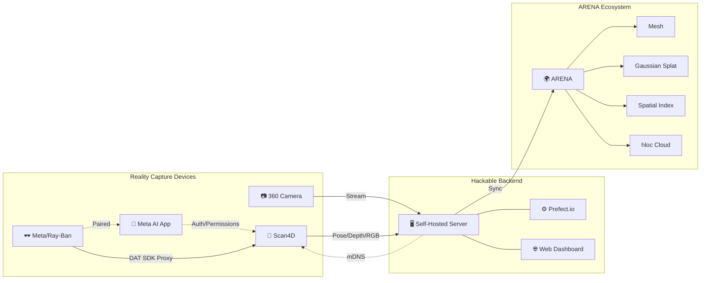
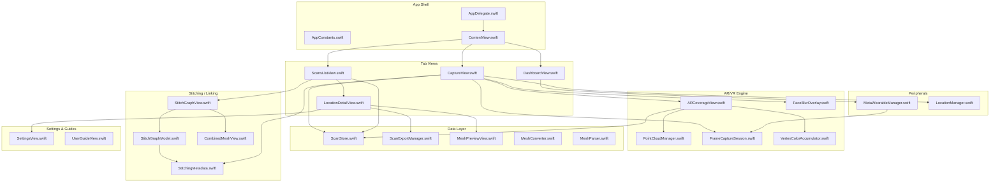
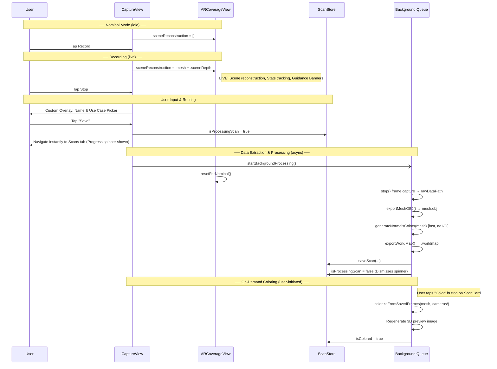
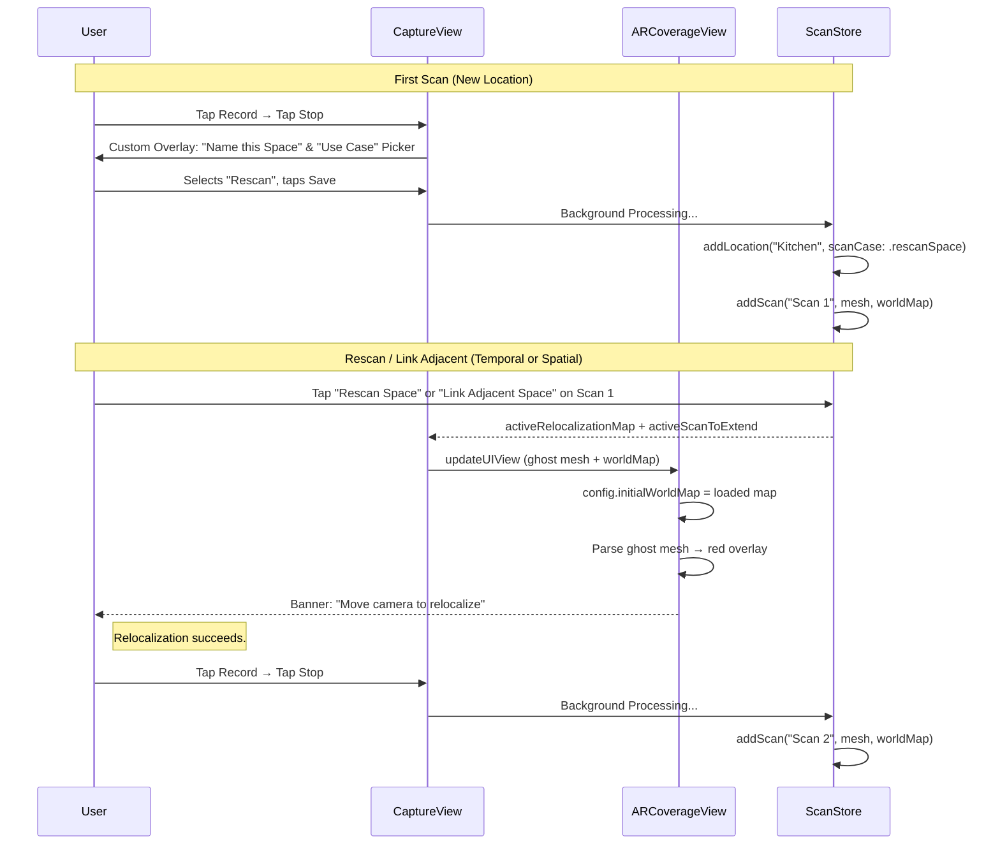
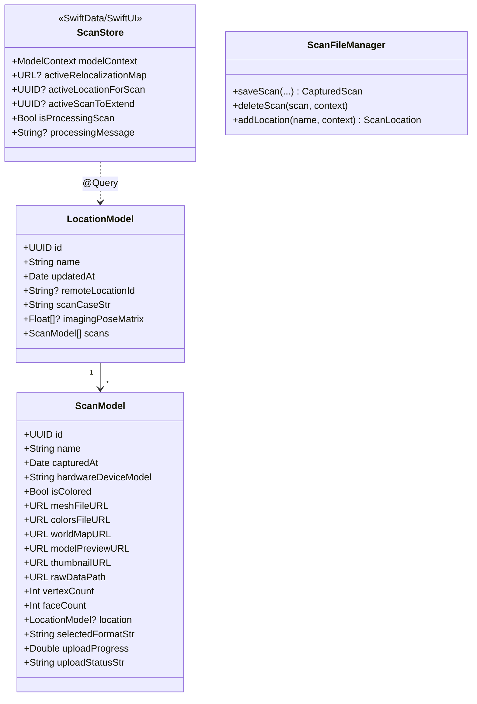
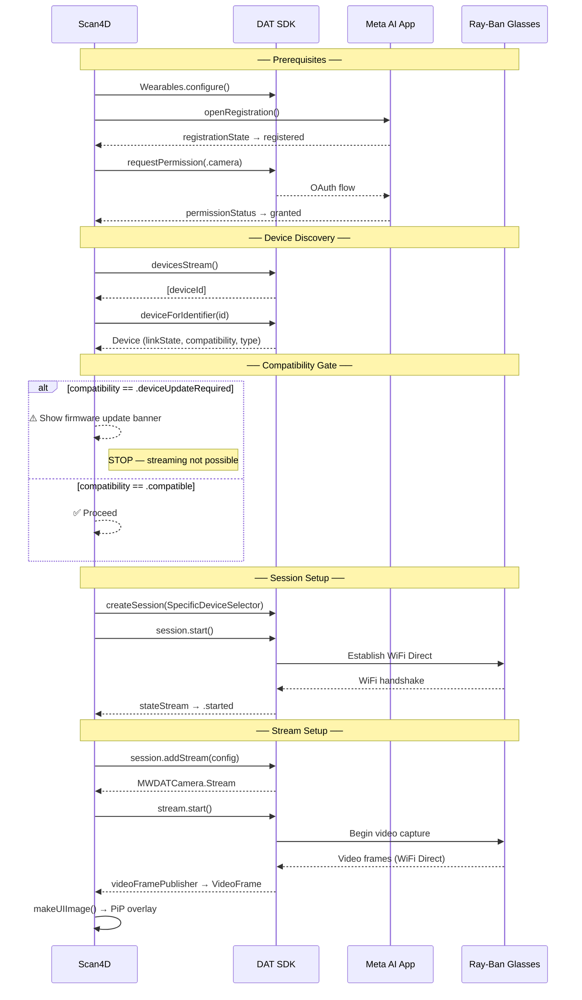

# Scan4D — Requirements & Architecture Reference

> **Purpose:** This is the single source of truth for feature requirements, architecture, and implementation status of the Scan4D application. It is designed to be consumed by both humans and AI coding assistants to maintain context across development sessions.
>
> **Maintainer note:** When adding a feature, update the relevant section below _and_ the corresponding entry in [README.md](README.md). When modifying architecture, update the diagrams and source links.

---

## System Context

Scan4D is a time-series reality capture application built on the WiSEScan research platform. It captures RGB, pose, and (on LiDAR-equipped devices) mesh and depth data. Non-LiDAR devices operate in **Lite Mode**, capturing images and camera poses for server-side photogrammetry. It can operate standalone (local capture + export) or connect to a self-hosted backend for orchestrated reconstruction pipelines.

**Related docs:**
- [Platform Architecture](../wiselab-scan/ARCHITECTURE.md) — Full system design
- [PlantUML Diagram](../wiselab-scan/wisescan-architecture.puml) — Rendered system diagram
- [iOS Design Spec](docs/design/DESIGN.md) — Original UI/UX design document
- [Troubleshooting Guide](docs/TROUBLESHOOTING.md) — Hardware quirks and recovery steps

---

## iOS App Architecture

### Source File Index

| File | Role | Key Types / Functions |
|:-----|:-----|:----------------------|
| [AppDelegate.swift](wisescan-ios/AppDelegate.swift) | App lifecycle, orientation locking | `AppDelegate`, `orientationLocked` |
| [AppConstants.swift](wisescan-ios/AppConstants.swift) | Centralized constants, defaults, pipeline tuning | `AppConstants`, `CaptureMode`, `Key`, `UI` |
| [ContentView.swift](wisescan-ios/ContentView.swift) | Root TabView (Dashboard, Capture, Scans), LiDAR check | `ContentView`, `hasLiDAR` |
| [DashboardView.swift](wisescan-ios/DashboardView.swift) | Server status, wearable pairing | `DashboardView` |
| [CaptureView.swift](wisescan-ios/CaptureView.swift) | Live capture UI, recording, Scan4D naming, capacity HUD | `CaptureView`, `startRecording()`, `stopRecording()`, `performStopRecording()`, `startBackgroundProcessing()` |
| [CaptureView+Recording.swift](wisescan-ios/CaptureView+Recording.swift) | Recording start/stop, save flow, world-map + VIO save safety | `savePendingScan()`, `writeStitchingLinkIfPending()` |
| [CaptureView+Extend.swift](wisescan-ios/CaptureView+Extend.swift) | Pin & Extend (mid-session boundary link) | extend/auto-save/reset flow |
| [CaptureView+Alignment.swift](wisescan-ios/CaptureView+Alignment.swift) | Link Adjacent (cross-session relocalization + alignment) | alignment flow, boundary-anchor matching |
| [AlignmentOverlayView.swift](wisescan-ios/AlignmentOverlayView.swift) | Cross-session alignment overlay (distance + tracking state) | `AlignmentOverlayView` |
| [ARCoverageView.swift](wisescan-ios/ARCoverageView.swift) | ARKit session, mesh wireframe (AR), point cloud (VR), mesh export | `ARCoverageView`, `Coordinator`, `exportMeshOBJ()`, `makeFreshConfiguration()`, `PointCloudManager` |
| [PointCloudManager.swift](wisescan-ios/PointCloudManager.swift) | VR mode: live depth point cloud rendering via Metal | `PointCloudManager`, `setup()`, `updatePointCloud()` |
| [FaceBlurOverlay.swift](wisescan-ios/FaceBlurOverlay.swift) | Live red-eye privacy indicator (from ARKit stencil) + pixelation utility for exports | `PrivacyEyeOverlay`, `PrivacyEyeTracker`, `PrivacyBlurUtil.pixelatePersonsWithMask()`, `pixelatePersonsAndGetFaceCenters()` |
| [FrameCaptureSession.swift](wisescan-ios/FrameCaptureSession.swift) | RAW data capture (RGB, depth, poses) | `FrameCaptureSession`, `start()`, `stop()`, `writeTransformsJSON()`, `writePolycamCameras()` |
| [LocationDetailView.swift](wisescan-ios/LocationDetailView.swift) | Per-location scan management, export, upload, preview | `LocationDetailView` |
| [ScansListView.swift](wisescan-ios/ScansListView.swift) | Scan cards, location groups, rename, upload, stitch graph entry | `ScansListView`, `ScanCard` |
| [StitchingMetadata.swift](wisescan-ios/StitchingMetadata.swift) | Boundary-anchor link manifest (`stitching.json`), async I/O | `StitchingLink`, `LinkType`, `StitchingMetadataManager` (`write`/`addLink`/`read`/`hasLinks`) |
| [StitchGraphModel.swift](wisescan-ios/StitchGraphModel.swift) | Linked-scan graph model (nodes, edges, components) | `StitchGraph`, `StitchGraphNode`, `StitchGraphEdge`, `StitchGraph.build(from:)` |
| [StitchGraphView.swift](wisescan-ios/StitchGraphView.swift) | Node-graph visualization of linked scans | `StitchGraphView` |
| [CombinedMeshView.swift](wisescan-ios/CombinedMeshView.swift) | Combined SceneKit view of all linked scans (optional per-map tint) | `CombinedMeshScreen`, `CombinedMeshView` |
| [MeshPreviewView.swift](wisescan-ios/MeshPreviewView.swift) | SceneKit 3D preview with vertex colors | `MeshPreviewView` |
| [ScanStore.swift](wisescan-ios/ScanStore.swift) | Data models, location hierarchy, capacity scoring | `ScanStore`, `ScanLocation`, `CapturedScan`, `ScanStats`, `capacityScore` |
| [ScanExportManager.swift](wisescan-ios/ScanExportManager.swift) | Export packaging for all formats | `ScanExportManager`, `prepareExport()` |
| [MeshConverter.swift](wisescan-ios/MeshConverter.swift) | OBJ→PLY and OBJ→USDZ mesh conversion | `MeshConverter.objToPLY()`, `MeshConverter.objToUSDZ()` |
| [MeshParser.swift](wisescan-ios/MeshParser.swift) | Wavefront OBJ parser | `MeshParser`, `OBJData`, `parseOBJ()` |
| [VertexColorAccumulator.swift](wisescan-ios/VertexColorAccumulator.swift) | Normals-based default coloring, on-demand vertex coloring, ARWorldMap export | `VertexColorAccumulator`, `generateNormalsColors()`, `colorizeFromSavedFrames()`, `exportWorldMap()` |
| [VoxelGrid.swift](wisescan-ios/VoxelGrid.swift) | Metal voxel grid for VR accumulated point cloud | `VoxelGrid` |
| [MetaWearableManager.swift](wisescan-ios/MetaWearableManager.swift) | Meta Wearables DAT SDK lifecycle, streaming, proxy frames | `MetaWearableManager` |
| [LocationManager.swift](wisescan-ios/LocationManager.swift) | GPS/heading updates for scan metadata | `LocationManager` |
| [PermissionsOverlay.swift](wisescan-ios/PermissionsOverlay.swift) | Camera/AR permission request UI | `PermissionsOverlay` |
| [SettingsView.swift](wisescan-ios/SettingsView.swift) | Upload URL, RAW settings, capture mode, Developer Mode | `SettingsView`, `developerMode`, `flipCameraEnabled` |
| [UserGuideView.swift](wisescan-ios/UserGuideView.swift) | In-app workflow guide | `UserGuideView` |
| [DemoDataSeeder.swift](wisescan-ios/DemoDataSeeder.swift) | Orphan scan discovery + SwiftData seeding | `DemoDataSeeder`, `seedIfNeeded()` |
| [TestDataGenerator.swift](wisescan-ios/TestDataGenerator.swift) | Mock camera intrinsics for testing | `TestDataGenerator` |
| [Shaders/PointCloud.metal](wisescan-ios/Shaders/PointCloud.metal) | VR point cloud vertex/fragment shaders | Metal GPU pipeline |
| [Shaders/Bloom.metal](wisescan-ios/Shaders/Bloom.metal) | Bloom post-processing shader | Metal GPU pipeline |
| [Shaders/Wireframe.metal](wisescan-ios/Shaders/Wireframe.metal) | AR wireframe rendering shaders | Metal GPU pipeline |

---

## Feature Requirements

### REQ-001: LiDAR Mesh Capture
| | |
|:--|:--|
| **Status** | ✅ Complete |
| **Description** | Real-time scene reconstruction using ARKit `ARWorldTrackingConfiguration` with `.mesh` scene reconstruction. Live wireframe overlay via `showSceneUnderstanding`. Only enabled on LiDAR-equipped devices (`ARCoverageView.supportsLiDAR`). |
| **Source** | [ARCoverageView.swift](wisescan-ios/ARCoverageView.swift) — `makeUIView()`, `supportsLiDAR` |
| **Dependencies** | LiDAR hardware (runtime-detected), iOS 17+ |

### REQ-001b: Lite Mode (No LiDAR)
| | |
|:--|:--|
| **Status** | ✅ Complete |
| **Description** | Non-LiDAR devices (iPhone 16, older iPads) run in Lite Mode: camera passthrough + image/pose capture for server-side photogrammetry. No mesh, depth, coverage overlay, or 3D face anchors. A blue "Lite Mode" banner is shown in CaptureView. ContentView shows an informational alert on launch. |
| **Source** | [ARCoverageView.swift](wisescan-ios/ARCoverageView.swift) — `supportsLiDAR`, [CaptureView.swift](wisescan-ios/CaptureView.swift) — lite mode banner, [FrameCaptureSession.swift](wisescan-ios/FrameCaptureSession.swift) — optional depth |
| **Dependencies** | ARKit (required), LiDAR (optional) |

### REQ-002: Start/Stop Recording
| | |
|:--|:--|
| **Status** | ✅ Complete |
| **Description** | Tap to start scanning with timer, tap again to stop and save. Capture view starts in **nominal mode** (camera passthrough only, no scene reconstruction). Recording activates full AR processing (mesh overlay, depth capture, capacity tracking). Stopping or leaving the view silently resets to nominal mode. Auto-stop on view disappear. |
| **Source** | [CaptureView.swift](wisescan-ios/CaptureView.swift) — `startRecording()`, `stopRecording()`, `.onDisappear` |

#### Capture Lifecycle: Nominal → Recording → User Prompt → Background Processing

### REQ-003: Scan4D (Rescan & Link Adjacent — Temporal & Spatial Capture)
| | |
|:--|:--|
| **Status** | ✅ Complete (Phase 1 — Local) |
| **Description** | Enable two complementary scanning intents — **Rescan Space** (*temporal*: re-capture the same area over time) and **Link Adjacent Space** (*spatial*: capture a neighboring area and stitch the chunks) — both powered by `ARWorldMap` relocalization and a ghost-mesh overlay. Provide conditional UI for specific capture sources. The spatial path joins chunks at a shared boundary anchor, dropped mid-session via **Pin & Extend** or matched cross-session via a guided alignment overlay — see REQ-012 for the boundary-anchor / `stitching.json` link layer that pairs the chunks for server-side alignment. |
| **Details** | **Use Case 1 — Time-Series Re-Scan:** Scan the same space again at a later time. The ghost overlay shows the original capture area; the user re-scans the identical region. The backend pipeline can diff or merge these scans to track changes over time. **Use Case 2 — Adjacent-Space Stitching:** Continue a scan into an adjacent area. The user moves to the edge of the ghost overlay and begins recording, overlapping slightly with the previous scan. The backend pipeline stitches the chunks together to build a single unified model. Both use cases share identical device-side mechanics: (1) **Intent Declaration:** The workflow intent (Rescan vs Link Adjacent) is explicitly chosen by the user in the initial save dialog (`ScanCase` picker). (2) **Relocalization Setup:** Tapping **Rescan Space** or **Link Adjacent Space** on any scan card loads that scan's `ARWorldMap` as the AR session initialization target. (3) **Ghost Visualization:** The selected scan's mesh renders as a configurable ghost-mesh overlay (default: magenta, adjustable in Settings). (4) **UI Prompting:** Live tracking banners instruct the user to "Move camera to relocalize" until the world map successfully aligns. |
| **Source** | [CaptureView+Extend.swift](wisescan-ios/CaptureView+Extend.swift) — Pin & Extend (mid-session) · [CaptureView+Alignment.swift](wisescan-ios/CaptureView+Alignment.swift) + [AlignmentOverlayView.swift](wisescan-ios/AlignmentOverlayView.swift) — Link Adjacent (cross-session) · [ARCoverageView.swift](wisescan-ios/ARCoverageView.swift) — `makeFreshConfiguration()`, ghost-mesh overlay, relocalization |

### REQ-004: Privacy Filtering
| | |
|:--|:--|
| **Status** | ✅ Complete |
| **Description** | Person segmentation removes humans from the mesh and zeroes them out of depth maps. All three privacy outputs (live indicator, saved JPEG blur, depth cutout) are driven by ARKit's already-computed `.personSegmentationWithDepth` stencil (`ARFrame.segmentationBuffer`), **not** a separate per-frame Vision pass (the old `.accurate VNGeneratePersonSegmentationRequest` cost 180–360 ms/frame and starved VIO — see REQ-027). **Live indicator:** a cheap **red-eye marker** per detected person, rendered over the camera feed — no Vision, no CoreImage render; a retained confidence grid (`PrivacyEyeTracker`) debounces the markers so they don't flicker. **Saved JPEGs (the actual guarantee):** person regions are pixelated from the stencil; a **Vision fallback** (`pixelatePersonsAndGetFaceCenters`) covers any frame where the stencil is unavailable (unsupported device / momentary gap) so a detected person is never written unblurred. **3D anchors:** one confidence-weighted, observation-gated body-center centroid **per person** (union-find–merged from the stencil, not per grid cell), unprojected against the 16-bit depth buffer; these `face_anchors` bypass mesh inclusion and mark the preview mesh as red indicators before the server deletes the bodies downstream. Persistent toggle via `@AppStorage`. The capture view is locked to portrait for consistent orientation alignment across the RealityKit scene, the overlay, and scene geometry (see REQ-026). |
| **Source** | [ARCoverageView.swift](wisescan-ios/ARCoverageView.swift) — `privacyFilter`, stencil-based mesh/point-cloud exclusion · [FaceBlurOverlay.swift](wisescan-ios/FaceBlurOverlay.swift) — `PrivacyEyeOverlay`, `PrivacyEyeTracker`, `PrivacyBlurUtil.pixelatePersonsWithMask()` / `pixelatePersonsAndGetFaceCenters()` (fallback) · [FrameCaptureSession.swift](wisescan-ios/FrameCaptureSession.swift) — privacy-aware frame capture + 3D anchor accumulation |

### REQ-005: 3D Scan Preview
| | |
|:--|:--|
| **Status** | ✅ Complete |
| **Description** | Interactive SceneKit preview. Initially displays normals-based coloring (standard tangent-space mapping: R=X, G=Y, B=Z). On-demand "Color" button triggers camera-sampled vertex coloring using up to 150 frames with a 150mm Depth Occlusion Culling threshold to prevent color bleeding through walls. Parses `scan4d_metadata.json` to spawn 3D Privacy Markers. Falls back to height-gradient coloring when no colors.bin exists. |
| **Source** | [MeshPreviewView.swift](wisescan-ios/MeshPreviewView.swift) · [VertexColorAccumulator.swift](wisescan-ios/VertexColorAccumulator.swift) — `generateNormalsColors()`, `colorizeFromSavedFrames()` |

### REQ-006: Export Formats & Backend Ingestion
| | |
|:--|:--|
| **Status** | ✅ Complete |
| **Description** | Each export format includes only the data relevant to that format. Scan4D bundles metadata + relocalization + Polycam payload. Polycam exports raw import data. RAW exports Nerfstudio-compatible poses. OBJ exports the raw mesh file. PLY and USDZ are converted from OBJ on-device via `MeshConverter`. |
| **Source** | [ARCoverageView.swift](wisescan-ios/ARCoverageView.swift) — `exportMeshOBJ()` · [FrameCaptureSession.swift](wisescan-ios/FrameCaptureSession.swift) — `writeTransformsJSON()` · [ScansListView.swift](wisescan-ios/ScansListView.swift) — `prepareExport()` · [MeshConverter.swift](wisescan-ios/MeshConverter.swift) — `objToPLY()`, `objToUSDZ()` |

### REQ-007: Save & Upload
| | |
|:--|:--|
| **Status** | ✅ Complete |
| **Description** | Save to Files via share sheet. HTTP PUT upload to configurable URL with status tracking (pending → uploading → success/failed). ZIP packaging for RAW/Polycam. |
| **Source** | [ScansListView.swift](wisescan-ios/ScansListView.swift) — `ScanCard`, `uploadScan()`, `saveToFiles()` |

### REQ-008: Server Status & Settings
| | |
|:--|:--|
| **Status** | ✅ Complete |
| **Description** | Dashboard shows server reachability via HTTP HEAD. Settings for upload URL, overlap %, blur rejection. In-app workflow guide. |
| **Source** | [DashboardView.swift](wisescan-ios/DashboardView.swift) · [SettingsView.swift](wisescan-ios/SettingsView.swift) |

### REQ-009: Scan Capture Data
| | |
|:--|:--|
| **Status** | ✅ Complete |
| **Description** | Adaptive-rate RGB frames (JPEG), 16-bit depth maps (PNG, mm), and camera poses. Overlap-based frame selection with motion blur rejection and real-time centered UI toast warnings for excessive motion. Features a fully isolated sequential `ioQueue` guaranteeing 1:1 parity between image, depth, and transform JSON drops natively bypassing async races. |
| **Source** | [FrameCaptureSession.swift](wisescan-ios/FrameCaptureSession.swift) — `captureFrame()`, `cameraMovement()` |

### REQ-010: Coverage Overlay
| | |
|:--|:--|
| **Status** | 🗑️ Removed |
| **Description** | Originally a 2D overlay using anchor bounding-box convex hulls and negative masking with a tiled image pattern. This feature and its assets (`CoverageMask`) were entirely removed to simplify the codebase in favor of native LiDAR mesh visualizing. |
| **Source** | N/A |
| **Assets** | N/A |

### REQ-011: Persistent Scan Storage
| | |
|:--|:--|
| **Status** | ✅ Complete |
| **Description** | SwiftData/SQLite for on-disk location and lightweight scan metadata. Binary assets are saved directly to file URLs on disk. |
| **Source** | [ScanStore.swift](wisescan-ios/ScanStore.swift) — `ScanFileManager`, `@Model ScanLocation`, `@Model CapturedScan` |

### REQ-012: Map Stitching and Coverage
| | |
|:--|:--|
| **Status** | ✅ Complete (Phase 1 — Local link layer) |
| **Description** | Prevent localized mesh limits from capping scan size by supporting both time-series re-scans and adjacent spatial mapping, and by recording an explicit **boundary-anchor link** between adjacent chunks for server-side alignment. |
| **Details** | **Unbounded chaining:** There is no upper limit on how many scans can exist inside a single Location; the old "Keep Last 2" retention limit was removed because all scans in a chain are needed to reconstruct the master scene (scans are deleted manually or purged on successful upload). **Two link flows:** *Pin & Extend* (mid-session) drops a boundary pin, auto-saves the current scan, resets ARKit, and starts a fresh session whose origin `[0,0,0]` is the boundary — no interaction beyond the initial tap. *Link Adjacent* (cross-session, from the location detail) loads the prior world map read-only, shows an alignment overlay (distance indicator + tracking state) guiding the user back to the boundary anchor, then drops a matching pin and starts fresh. **`stitching.json` manifest:** each link is a `Codable` `StitchingLink` pairing source/target `{location, scan, anchor}` IDs, both 4×4 anchor transforms, per-end compass headings, a timestamp, and a `LinkType` (`.midSession` / `.crossSession`). The manifest is written per-location and bundled in every Scan4D export zip so uploads are self-contained. Writes are deferred until the target scan ID exists (see the deferred-write contract in CONTRIBUTING.md). **Visualization:** the Scans list surfaces a node-graph of linked scans (connected components, boundary edges) and a combined-mesh viewer that loads every linked scan into one SceneKit scene, optionally tinted per source map. |
| **Source** | [StitchingMetadata.swift](wisescan-ios/StitchingMetadata.swift) — `StitchingLink`, `LinkType`, `StitchingMetadataManager` (async `write`/`addLink`, sync `read`/`hasLinks`) · [CaptureView+Extend.swift](wisescan-ios/CaptureView+Extend.swift) / [CaptureView+Alignment.swift](wisescan-ios/CaptureView+Alignment.swift) — link flows · [StitchGraphModel.swift](wisescan-ios/StitchGraphModel.swift) + [StitchGraphView.swift](wisescan-ios/StitchGraphView.swift) — linked-scan graph · [CombinedMeshView.swift](wisescan-ios/CombinedMeshView.swift) — combined-mesh viewer · [ScansListView.swift](wisescan-ios/ScansListView.swift) — entry points |
| **Notes** | The device only captures and annotates the boundary link; final alignment (ICP / photogrammetry) is a server-side concern (see Anchoring Strategy). Implementation invariants live in CONTRIBUTING.md → "Stitching / Scan Linking — Implementation Contract". |

### REQ-013: Developer Mode
| | |
|:--|:--|
| **Status** | ✅ Complete |
| **Description** | Toggleable debugging section in Settings with persistent `@AppStorage` switches. Includes Flip Camera (front/back switching via `ARFaceTrackingConfiguration`), persistent orange banner across all tabs with tap-to-disable (auto-scrolls to Settings section). Camera auto-reverts to back when dev mode is disabled. |
| **Source** | [SettingsView.swift](wisescan-ios/SettingsView.swift) — `developerMode`, `flipCameraEnabled` · [ContentView.swift](wisescan-ios/ContentView.swift) — banner overlay · [CaptureView.swift](wisescan-ios/CaptureView.swift) — flip button · [ARCoverageView.swift](wisescan-ios/ARCoverageView.swift) — `ARFaceTrackingConfiguration` switching |

### REQ-014: Scan Capacity Metrics
| | |
|:--|:--|
| **Status** | ✅ Complete |
| **Description** | Live HUD showing polygon count, anchor count (~area), drift level, and session duration. Composite capacity score (0–1) using `max(polygonPressure, memoryPressure, anchorPressure, driftEstimate)`. Color-coded progress bar (green→yellow→red). Warning banners at >80% and >95% capacity. Memory tracks delta from session baseline, not absolute footprint. |
| **Source** | [ScanStore.swift](wisescan-ios/ScanStore.swift) — `ScanStats.capacityScore`, `currentMemoryUsageMB()` · [ARCoverageView.swift](wisescan-ios/ARCoverageView.swift) — `Coordinator.updateStats()`, drift tracking · [CaptureView.swift](wisescan-ios/CaptureView.swift) — redesigned HUD |
| **Design Doc** | [Scan4D_Architecture.md](docs/design/Scan4D_Architecture.md) — "Large-Space Scanning & Map Stitching" section |

### REQ-015: Location Rename
| | |
|:--|:--|
| **Status** | ✅ Complete |
| **Description** | In Edit mode, location group names become tappable (orange with pencil icon) to trigger a rename alert with text field. Saves directly to SwiftData. |
| **Source** | [ScansListView.swift](wisescan-ios/ScansListView.swift) — `showRenameAlert`, `locationToRename` |

### REQ-017: Wearable Proxy
| | |
|:--|:--|
| **Status** | ✅ Complete |
| **Description** | Proxy Mode Data Collection connects to Meta Ray-Ban glasses using the Meta Wearables DAT SDK. Connections are managed in the background via the dashboard's connection card. Listens for hardware shutter button presses to start/stop recordings and streams RGB frames natively into the app, eliminating the need for a WebRTC receiver loop. Includes a 15 FPS manual rate limiter to prevent massive proxy image bloat, strict frame-isolation by saving Wearable frames to a separate `proxy_images/` directory in the export payload, and an immediate session teardown mechanism when unregistering to prevent stale UI state. |
| **Source** | `MetaWearableManager.swift` (SDK Lifecycle) · `FrameCaptureSession.swift` (Frame Ingestion) · `ScansListView.swift` (Zipping/Export Management) |

### REQ-025: VR Capture Mode
| | |
|:--|:--|
| **Status** | ✅ Complete |
| **Description** | Alternative capture mode that replaces the AR camera passthrough with a live depth point cloud rendered on a black background using Metal shaders. Toggled via `CaptureMode` enum in Settings (AR vs VR). In VR mode: ARView background is set to `.color(.black)`, `PointCloudManager` creates billboard quads from LiDAR `sceneDepth` at 256×192 resolution, colored by the camera feed via a GPU compute kernel. Mesh wireframes are disabled; point cloud entities replace them as the scene geometry layer. Privacy segmentation overlay still operates identically (same orientation architecture applies). Requires LiDAR hardware and `ARWorldTrackingConfiguration.supportsFrameSemantics(.sceneDepth)`. |
| **Source** | [ARCoverageView.swift](wisescan-ios/ARCoverageView.swift) — `captureMode`, VR setup/teardown · [PointCloudManager.swift](wisescan-ios/PointCloudManager.swift) — `setup()`, `updatePointCloud()` · [Shaders/PointCloud.metal](wisescan-ios/Shaders/PointCloud.metal) — vertex/fragment shaders · [AppConstants.swift](wisescan-ios/AppConstants.swift) — `CaptureMode` enum · [SettingsView.swift](wisescan-ios/SettingsView.swift) — capture mode picker |

### REQ-026: Orientation Locking
| | |
|:--|:--|
| **Status** | ✅ Complete |
| **Description** | The capture view is locked to portrait orientation during scanning to ensure consistent alignment between three independent rendering layers: (1) the RealityKit scene (camera feed in AR or point cloud in VR), (2) the privacy segmentation overlay (SwiftUI), and (3) scene geometry (mesh wireframe in AR, point cloud in VR). Without this lock, the privacy overlay can appear rotated 90°/180° relative to the actual person position because ARKit's `capturedImage` is always in landscape-right sensor coordinates regardless of device orientation. The lock is implemented via `AppDelegate.orientationLocked` (runtime `supportedInterfaceOrientations`) and portrait-only `UISupportedInterfaceOrientations` in the project settings. iPadOS Stage Manager can override this lock, but the overlay handles it gracefully via `scaledToFill().clipped()`. |
| **Source** | [CaptureView.swift](wisescan-ios/CaptureView.swift) — `onAppear`/`onDisappear` orientation lock · [AppDelegate.swift](wisescan-ios/AppDelegate.swift) — `orientationLocked` · [FaceBlurOverlay.swift](wisescan-ios/FaceBlurOverlay.swift) — full orientation architecture documentation |
| **TODO** | Apple will eventually require all-orientation support on iPad (`UIRequiresFullScreen` deprecation). See FaceBlurOverlay.swift orientation architecture comments for migration plan. |

### REQ-027: Capture Performance, Session Lifecycle & VIO Integrity
| | |
|:--|:--|
| **Status** | ✅ Complete |
| **Description** | Guarantees that reality capture does not stall the main thread or starve ARKit's visual-inertial odometry (VIO), which otherwise produces multi-second freezes and drifted geometry (`ARSession ... is retaining N ARFrames`). **(1) Off-main delegate:** `session.delegateQueue` is a serial background queue; RealityKit/SwiftUI mutations are dispatched to main, delegate-owned dicts/counters stay on the delegate queue. **(2) Off-main capture I/O:** per-frame writes, encodes, mesh + world-map export run off main; at stop, capture is paused on main then flushed on a utility queue, and the capture screen is left before the name prompt so the keyboard never renders over a live `ARView`. **(3) Backlog guard:** capture coalesces and won't enqueue a new save while a prior encode is in flight (`AppConstants.maxFramesInFlight`), capping retained `CVPixelBuffer`s. **(4) Single segmentation source:** privacy blur/anchors/indicator reuse ARKit's `.personSegmentationWithDepth` stencil instead of a per-frame Vision pass (see REQ-004). **(5) Warm session + battery:** the session is kept warm between scans (a cold start costs ~13 s and blocks main on pre-A14 devices); an idle timer (`AppConstants.arIdleTeardownSeconds`) pauses it only after the user leaves the capture tab, and resume re-runs the nominal config with no main stall. Leaving the capture tab abandons an in-progress Extend; re-tap Extend to restore the ghost. **(6) Cross-scan anchor hygiene:** a new scan's record-start runs with `.removeExistingAnchors` so a prior scan's mesh can't bleed into its export; an extend preserves anchors. **(7) VIO guard:** sustained tracking loss or a frame-delivery gap mid-recording (`vioFrameGapTripSeconds` / `vioDegradedTripSeconds`) halts capture with a "Tracking Lost" alert (Save Anyway / Discard — no Continue, so good and post-loss frames are never mixed). **(8) World-map integrity:** a failed `getCurrentWorldMap` is surfaced (Try Again / Save Without Map) rather than silently saving a non-relocalizable scan. All of this is observable via **PerfDiag** (Developer Mode → Perf Diagnostics): `MainThreadWatchdog`, ARKit frame-gap + tracking-state logger, I/O backlog counter, GPU/voxel timings — OSLog subsystem `org.arenaxr.scan4d` + `os_signpost`. |
| **Source** | [ARCoverageView.swift](wisescan-ios/ARCoverageView.swift) — off-main delegate, VIO guard, `.removeExistingAnchors`, battery pause/resume · [CaptureView.swift](wisescan-ios/CaptureView.swift) — off-main stop/flush, idle-teardown timer, world-map prompt, `handleVIOCompromised()` · [FrameCaptureSession.swift](wisescan-ios/FrameCaptureSession.swift) — backlog guard, off-main encodes · [PerfDiag.swift](wisescan-ios/PerfDiag.swift) — diagnostics · [AppConstants.swift](wisescan-ios/AppConstants.swift) — `maxFramesInFlight`, `arIdleTeardownSeconds`, `vioFrameGapTripSeconds`, `vioDegradedTripSeconds` |
| **Notes** | Dead end (do not retry): tearing down or pausing the session for battery *while the delegate was on main* caused ~13 s cold-start freezes on open and stop. Moving the delegate off main is the prerequisite that made the idle-pause viable. |

---

## Planned Features

| ID | Feature | Description | Priority |
|:---|:--------|:------------|:---------|
| REQ-016 | Server Discovery | Detect local Prefect servers via mDNS/Bonjour | Medium |
| REQ-018 | Streaming Mode | Real-time lower-res tracking data to server | Medium |
| REQ-019 | Workflow Orchestration | Select preset server pipelines (Mesh, Splat, Spatial Indexing) | High |
| REQ-020 | Job Observability | Display remote Prefect job status locally | Medium |
| ~~REQ-021~~ | ~~Scan4D Ghost Overlay~~ | ✅ **Implemented** — Red translucent overlay renders previous scan during Rescan / Link Adjacent | — |
| REQ-022 | Scan4D Ground Truth Offset | Capture GPS or AprilTag data alongside scans for backend alignment seeding | High |
| REQ-023 | OpenFLAME Live Relocalization | Use backend server to stream visual localization back to device, bypassing ARKit maps | Low |
| ~~REQ-024~~ | ~~Large-Space Map Stitching~~ | ✅ **Implemented (client-side)** — Pin & Extend / Link Adjacent chunking with shared coordinate frames + boundary-anchor `stitching.json` links, graph + combined-mesh views; server-side alignment is downstream. See REQ-012 | — |
| REQ-025 | VR Capture Mode | ✅ **Implemented** — see REQ-025 below | — |
| REQ-026 | Orientation Locking | ✅ **Implemented** — see REQ-026 below | — |
| REQ-027 | Capture Performance, Session Lifecycle & VIO Integrity | ✅ **Implemented** — see REQ-027 below | — |

---

## Data Model

**Source:** [ScanStore.swift](wisescan-ios/ScanStore.swift)

---

## Anchoring Strategy (Scan4D)

| Mechanism | Role | Reliability | Best Use |
|:----------|:-----|:------------|:---------|
| **Backend ICP Alignment** | **Ultimate Truth** | ⭐⭐⭐⭐ | High-fidelity historical alignment of point clouds/splats on the server. |
| **GPS / Anchor Tags** | **Ground Truth Seed**| ⭐⭐⭐⭐⭐ | Categorical offset to give the backend a starting guess before ICP. |
| **`ARWorldMap`** | **Edge UI Guide** | ⭐⭐ | Transient local caching to power the live "ghost overlay" UI during capture. |
| OpenFLAME | Server-Assisted UI | ⭐⭐⭐ | Future upgrade for live UI guiding, streaming visual features to backend. |
| RoomPlan API | Deprioritized | ⭐⭐⭐ | Apple-locked semantic tracking; better handled off-device by the server. |

**Current implementation:** `ARWorldMap` is saved categorically and used for Edge UI relocalization. See [Design/Scan4D_Architecture.md](docs/design/Scan4D_Architecture.md) for full rationale on the Backend-First philosophy.

---

## Export Format Reference

Each format includes only its own payload — no universal base.

| Format | Extension | Contents | Target Tool |
|:-------|:----------|:---------|:------------|
| Scan4D | `.zip` | `scan4d_metadata.json`, `relocalization.worldmap`, `images/`, `depth/`, `cameras/`, `mesh_info.json` | Scan4D server workflows |
| Polycam | `.zip` | `images/`, `depth/`, `cameras/`, `mesh_info.json` | Polycam raw data import |
| RAW | `.zip` | `images/`, `depth/`, `transforms.json` | Nerfstudio, COLMAP |
| OBJ | `.obj` | Single mesh file (no vertex colors) | MeshLab, Blender |
| PLY | `.ply` | Converted mesh with embedded vertex colors | MeshLab, CloudCompare |
| USDZ | `.usdz` | Converted mesh via ModelIO | iOS Quick Look |

---

## Physical Layer Prerequisites & Failure Guards

The app operates across multiple physical channels (Bluetooth, WiFi Direct, ARKit, on-device sensors). Each channel has prerequisites that can fail independently. This section documents every prerequisite, the failure mode, and how the app guards against it.

### Prerequisite Matrix

| # | Layer | Prerequisite | Failure Mode | App Guard | Status |
|:--|:------|:-------------|:-------------|:----------|:-------|
| P-01 | iOS | Camera permission (`NSCameraUsageDescription`) | ARKit session refuses to start; no video feed | System prompt on first launch; required for any capture | ✅ Handled |
| P-02 | iOS | Location permission (`NSLocationWhenInUseUsageDescription`) | No GPS coordinates embedded in scan metadata | System prompt; scans still work without GPS but lack ground-truth anchoring | ✅ Handled |
| P-03 | iOS | Local Network permission (`NSLocalNetworkUsageDescription`) | Cannot reach self-hosted backend for upload/mDNS discovery | System prompt; offline capture still works | ✅ Handled |
| P-04 | iOS | ARKit hardware support | App cannot capture 3D data | Runtime `ARWorldTrackingConfiguration.isSupported` check | ✅ Handled |
| P-05 | iOS | LiDAR hardware | No mesh, depth, or coverage overlay | Runtime `supportsLiDAR` check → Lite Mode banner | ✅ Handled |
| P-06 | Wearable | Meta AI app installed + glasses paired | `Wearables.shared.devices` returns empty | Dashboard shows "No devices found"; device observation stream auto-retries | ✅ Handled |
| P-07 | Wearable | Developer Mode enabled on glasses | SDK registration may fail; streaming unavailable | Logged via registration state observation; user directed to Meta AI app | ⚠️ Logged only |
| P-08 | Wearable | DAT SDK app registration (via Meta AI OAuth) | `registrationState` remains unregistered | `openRegistration()` called from Dashboard; state monitored via `registrationStateStream()` | ✅ Handled |
| P-09 | Wearable | DAT SDK camera permission (granted via Meta AI) | `checkPermissionStatus(.camera)` returns denied | Warning banner: "Meta App Permission Required"; re-checks on foreground | ✅ Handled |
| P-10 | Wearable | Glasses firmware compatibility | `device.compatibility()` returns `.deviceUpdateRequired`; `DeviceSession.start()` throws `noEligibleDevice` | `deviceUpdateRequired` flag → orange CaptureView banner: "Glasses firmware update required — open Meta AI app to update" | ✅ Handled |
| P-11 | Wearable | Bluetooth connection (`linkState`) | `device.linkState` is `.disconnected` or `.connecting` | `addLinkStateListener` waits for `.connected` before creating session | ✅ Handled |
| P-12 | Wearable | WiFi Direct side-channel (SDK-managed) | Video frames cannot be delivered over Bluetooth alone; SDK internally establishes WiFi Direct for media transfer | SDK handles this transparently; phone auto-joins glasses WiFi network (e.g., "RBMeta 08NR -2") when streaming starts. Failure manifests as `noEligibleDevice` or nil frames | ⚠️ SDK-managed |
| P-13 | Wearable | Meta AI app version ≥ v254 | SDK initialization or registration may fail silently | Logged; no direct version check available in SDK | ⚠️ Logged only |
| P-14 | Wearable | SDK version ↔ firmware version match | `device.compatibility()` returns `.sdkUpdateRequired` | Logged; developer must update the SDK package | ⚠️ Logged only |
| P-15 | Wearable | `DeviceSession` reaches `.started` state | Session may hang in `.starting` or error via `errorStream` | `stateStream()` + `errorStream()` racing pattern (from official sample); timeout and cleanup on failure | ✅ Handled |
| P-16 | Wearable | `addStream()` returns non-nil | Stream cannot be created even with valid session | Logged with session state; session stopped and cleaned up | ✅ Handled |

### Wearable Streaming Lifecycle

The DAT SDK enforces a strict lifecycle. Each step must succeed before the next can proceed:

### iOS Permission Keys

Configured in the Xcode project (`project.pbxproj` Info.plist keys):

| Key | Value | Required For |
|:----|:------|:-------------|
| `NSCameraUsageDescription` | "Camera is required for AR capture and streaming." | ARKit session, wearable proxy |
| `NSLocationWhenInUseUsageDescription` | "Scan4D requires Location data to assign a ground truth position..." | GPS metadata in scans |
| `NSLocalNetworkUsageDescription` | "Local Network is required to connect to Scan4D servers." | Backend upload, mDNS |

### Wearable Hardware Requirements

| Requirement | Minimum | Notes |
|:------------|:--------|:------|
| Glasses model | Ray-Ban Meta Gen 1/2 or Meta Ray-Ban Display | `device.deviceType()` returns `.rayBanMeta` |
| Glasses firmware | v20+ (Ray-Ban Meta), v21+ (Display) | Check via `device.compatibility()` |
| Meta AI app | v254+ | Required for registration and permission flows |
| iOS version | 15.2+ | DAT SDK minimum |
| Developer Mode | Enabled on glasses | Toggle in Meta AI app settings |

**Source:** [MetaWearableManager.swift](wisescan-ios/MetaWearableManager.swift) — `setupStreamSession()`, `updateConnectedDevices()`, `deviceUpdateRequired`

---
