# Scan4D — Requirements & Architecture Reference

> **Purpose:** This is the single source of truth for feature requirements, architecture, and implementation status of the Scan4D application. It is designed to be consumed by both humans and AI coding assistants to maintain context across development sessions.
>
> **Maintainer note:** When adding a feature, update the relevant section below _and_ the corresponding entry in [README.md](README.md). When modifying architecture, update the diagrams and source links.

---

## System Context

Scan4D is a time-series reality capture application built on the WiSEScan research platform. It captures RGB, pose, and (on LiDAR-equipped devices) mesh and depth data. Non-LiDAR devices operate in **Lite Mode**, capturing images and camera poses for server-side photogrammetry (Note: Lite Mode is only available on local debug builds; Release builds strictly require LiDAR). It can operate standalone (local capture + export) or connect to a self-hosted backend for orchestrated reconstruction pipelines.

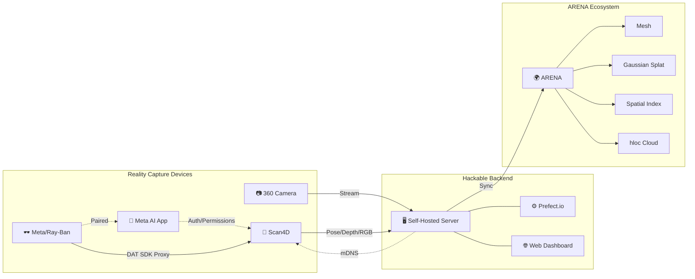
```mermaid
graph LR
    subgraph "Reality Capture Devices"
        Phone["📱 Scan4D"]
        MetaAI["📱 Meta AI App"]
        Glasses["🕶️ Meta/Ray-Ban"]
        Cam360["📷 360 Camera"]
    end

    subgraph "Hackable Backend"
        Server["🖥️ Self-Hosted Server"]
        Prefect["⚙️ Prefect.io"]
        Dashboard["🌐 Web Dashboard"]
    end

    subgraph "ARENA Ecosystem"
        Arena["🌍 ARENA"]
        Mesh["Mesh"]
        Splat["Gaussian Splat"]
        SpatialIdx["Spatial Index"]
        Hloc["hloc Cloud"]
    end

    Glasses -.->|Paired| MetaAI
    MetaAI -.->|Auth/Permissions| Phone
    Glasses -->|DAT SDK Proxy| Phone
    Cam360 -->|Stream| Server
    Phone -->|Pose/Depth/RGB| Server
    Server -.->|mDNS| Phone
    Server --- Dashboard
    Server --- Prefect
    Server -->|Sync| Arena
    Arena --> Mesh
    Arena --> Splat
    Arena --> SpatialIdx
    Arena --> Hloc
```

**Related docs:**
- [Platform Architecture](../wiselab-scan/ARCHITECTURE.md) — Full system design
- [PlantUML Diagram](../wiselab-scan/wisescan-architecture.puml) — Rendered system diagram
- [iOS Design Spec](docs/design/DESIGN.md) — Original UI/UX design document
- [Troubleshooting Guide](docs/TROUBLESHOOTING.md) — Hardware quirks and recovery steps

---

## iOS App Architecture

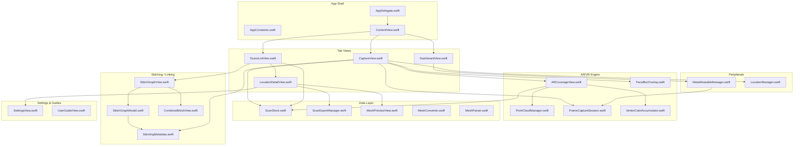
```mermaid
graph TD
    subgraph "App Shell"
        AD[AppDelegate.swift]
        AC[AppConstants.swift]
        CV[ContentView.swift]
    end

    subgraph "Tab Views"
        DV[DashboardView.swift]
        CAP[CaptureView.swift]
        LDV[LocationDetailView.swift]
        WV[ScansListView.swift]
    end

    subgraph "AR/VR Engine"
        ARC[ARCoverageView.swift]
        PCM[PointCloudManager.swift]
        FBO[FaceBlurOverlay.swift]
        FCS[FrameCaptureSession.swift]
        VCA[VertexColorAccumulator.swift]
    end

    subgraph "Data Layer"
        SS[ScanStore.swift]
        SEM[ScanExportManager.swift]
        MP[MeshPreviewView.swift]
        MC[MeshConverter.swift]
        MPR[MeshParser.swift]
    end

    subgraph "Stitching / Linking"
        SM[StitchingMetadata.swift]
        SGM[StitchGraphModel.swift]
        SGV[StitchGraphView.swift]
        CMV[CombinedMeshView.swift]
    end

    subgraph "Peripherals"
        MWM[MetaWearableManager.swift]
        LM[LocationManager.swift]
    end

    subgraph "Settings & Guides"
        SV[SettingsView.swift]
        UG[UserGuideView.swift]
    end

    AD --> CV
    CV --> DV
    CV --> CAP
    CV --> WV
    CAP --> ARC
    CAP --> FBO
    CAP --> FCS
    CAP --> SS
    ARC --> PCM
    ARC --> VCA
    WV --> SS
    WV --> LDV
    WV --> SGV
    SGV --> SGM
    SGV --> CMV
    SGM --> SM
    CAP --> SM
    LDV --> SEM
    LDV --> MP
    LDV --> SV
    ARC --> SS
    DV --> MWM
    MWM --> FCS
    CAP --> LM
```

### Source File Index

| File | Role | Key Types / Functions |
|:-----|:-----|:----------------------|
| [AppDelegate.swift](wisescan-ios/AppDelegate.swift) | App lifecycle, orientation locking | `AppDelegate`, `orientationLocked` |
| [AppConstants.swift](wisescan-ios/AppConstants.swift) | Centralized constants, defaults, pipeline tuning | `AppConstants`, `CaptureMode`, `Key`, `UI` |
| [ContentView.swift](wisescan-ios/ContentView.swift) | Root TabView (Dashboard, Capture, Scans), LiDAR check | `ContentView`, `hasLiDAR` |
| [DashboardView.swift](wisescan-ios/DashboardView.swift) | Server status, wearable pairing | `DashboardView` |
| [CaptureView.swift](wisescan-ios/CaptureView.swift) | Live capture UI, recording, Scan4D naming, capacity HUD | `CaptureView`, `startRecording()`, `stopRecording()`, `performStopRecording()`, `startBackgroundProcessing()` |
| [CaptureView+Recording.swift](wisescan-ios/CaptureView+Recording.swift) | Recording start/stop, save flow, world-map + VIO save safety | `savePendingScan()`, `writeStitchingLinkIfPending()` |
| [CaptureView+Extend.swift](wisescan-ios/CaptureView+Extend.swift) | Pin & Extend (mid-session boundary link) | extend/auto-save/reset flow |
| [CaptureView+Alignment.swift](wisescan-ios/CaptureView+Alignment.swift) | Link Adjacent (cross-session relocalization + alignment) | alignment flow, boundary-anchor matching |
| [AlignmentOverlayView.swift](wisescan-ios/AlignmentOverlayView.swift) | Cross-session alignment overlay (distance + tracking state) | `AlignmentOverlayView` |
| [ARCoverageView.swift](wisescan-ios/ARCoverageView.swift) | ARKit session, mesh wireframe (AR), point cloud (VR), mesh export | `ARCoverageView`, `Coordinator`, `exportMeshOBJ()`, `makeFreshConfiguration()`, `PointCloudManager` |
| [PointCloudManager.swift](wisescan-ios/PointCloudManager.swift) | VR mode: live depth point cloud rendering via Metal | `PointCloudManager`, `setup()`, `updatePointCloud()` |
| [FaceBlurOverlay.swift](wisescan-ios/FaceBlurOverlay.swift) | Live red-eye privacy indicator (from ARKit stencil) + pixelation utility for exports | `PrivacyEyeOverlay`, `PrivacyEyeTracker`, `PrivacyBlurUtil.pixelatePersonsWithMask()`, `pixelatePersonsAndGetFaceCenters()` |
| [FrameCaptureSession.swift](wisescan-ios/FrameCaptureSession.swift) | RAW data capture (RGB, depth, poses), stillness detection, hi-res keyframes | `FrameCaptureSession`, `start()`, `stop()`, `requestStillCapture()`, `writeTransformsJSON()`, `writePolycamCameras()` |
| [StillnessReticle.swift](wisescan-ios/StillnessReticle.swift) | Capture-quality reticle: ring fills as device settles | `StillnessReticle` |
| [PhotoCoverageGrid.swift](wisescan-ios/PhotoCoverageGrid.swift) | World-space voxel grid tracking photo coverage (amber overlay source) | `PhotoCoverageGrid`, `stamp()` |
| [LocationDetailView.swift](wisescan-ios/LocationDetailView.swift) | Per-location scan management, export, upload, preview | `LocationDetailView` |
| [ScansListView.swift](wisescan-ios/ScansListView.swift) | Scan cards, location groups, rename, upload, stitch graph entry | `ScansListView`, `ScanCard` |
| [StitchingMetadata.swift](wisescan-ios/StitchingMetadata.swift) | Boundary-anchor link manifest (`stitching.json`), async I/O | `StitchingLink`, `LinkType`, `StitchingMetadataManager` (`write`/`addLink`/`read`/`hasLinks`) |
| [StitchLinkModel.swift](wisescan-ios/StitchLinkModel.swift) | Structured logging for the stitch-link subsystem | `stitchLog` |
| [ThumbnailCache.swift](wisescan-ios/ThumbnailCache.swift) | Downsampled on-disk thumbnail decode + memory cache | `ThumbnailCache` |
| [StitchGraphModel.swift](wisescan-ios/StitchGraphModel.swift) | Linked-scan graph model (nodes, edges, components) | `StitchGraph`, `StitchGraphNode`, `StitchGraphEdge`, `StitchGraph.build(from:)` |
| [StitchGraphView.swift](wisescan-ios/StitchGraphView.swift) | Node-graph visualization of linked scans | `StitchGraphView` |
| [CombinedMeshView.swift](wisescan-ios/CombinedMeshView.swift) | Combined SceneKit view of all linked scans (optional per-map tint) | `CombinedMeshScreen`, `CombinedMeshView` |
| [MeshPreviewView.swift](wisescan-ios/MeshPreviewView.swift) | SceneKit 3D preview with vertex colors | `MeshPreviewView` |
| [MeshPreviewView+KeyframeFrustums.swift](wisescan-ios/MeshPreviewView+KeyframeFrustums.swift) | Camera frustum markers (stills/motion) in the mesh preview | `KeyframeMarkerMode`, frustum node builders |
| [ScanStore.swift](wisescan-ios/ScanStore.swift) | Data models, location hierarchy, capacity scoring | `ScanStore`, `ScanLocation`, `CapturedScan`, `ScanStats`, `capacityScore` |
| [ScanExportManager.swift](wisescan-ios/ScanExportManager.swift) | Export packaging for all formats | `ScanExportManager`, `prepareExport()` |
| [ScanPostprocessor.swift](wisescan-ios/ScanPostprocessor.swift) | Process step: registration bake, ghost proxy, colorize, gates, bad-scan check | `ScanPostprocessor`, `pendingSteps()`, `needsPostprocess()`, `scheduleBadScanCheck()` |
| [PlaneRegistration.swift](wisescan-ios/PlaneRegistration.swift) | Gravity-locked 4-DOF plane-registration solver (canonical frame) | `PlaneRegistration`, observability gate, trim rescue |
| [SaveRegistration.swift](wisescan-ios/SaveRegistration.swift) | Transactional registration bake + `registration.json` sidecar | `SaveRegistration`, `writeSidecar()`, `retransformRoomPlanJSON()` |
| [RoomPlanExporter.swift](wisescan-ios/RoomPlanExporter.swift) | `roomplan.json` / `roomplan_raw.json` sidecar writers | `RoomPlanExporter` |
| [MeshConverter.swift](wisescan-ios/MeshConverter.swift) | OBJ→PLY and OBJ→USDZ mesh conversion | `MeshConverter.objToPLY()`, `MeshConverter.objToUSDZ()` |
| [MeshParser.swift](wisescan-ios/MeshParser.swift) | Wavefront OBJ parser | `MeshParser`, `OBJData`, `parseOBJ()` |
| [VertexColorAccumulator.swift](wisescan-ios/VertexColorAccumulator.swift) | Normals-based default coloring, on-demand vertex coloring, ARWorldMap export | `VertexColorAccumulator`, `generateNormalsColors()`, `colorizeFromSavedFrames()`, `exportWorldMap()` |
| [VoxelGrid.swift](wisescan-ios/VoxelGrid.swift) | Metal voxel grid for VR accumulated point cloud | `VoxelGrid` |
| [VoxelGrid+Extraction.swift](wisescan-ios/VoxelGrid+Extraction.swift) | Mesh-extraction packing for the VR voxel grid | `VoxelGrid` extension |
| [MetaWearableManager.swift](wisescan-ios/MetaWearableManager.swift) | Meta Wearables DAT SDK lifecycle, streaming, proxy frames | `MetaWearableManager` |
| [LocationManager.swift](wisescan-ios/LocationManager.swift) | GPS/heading updates for scan metadata | `LocationManager` |
| [PermissionsOverlay.swift](wisescan-ios/PermissionsOverlay.swift) | Camera/AR permission request UI | `PermissionsOverlay` |
| [SettingsView.swift](wisescan-ios/SettingsView.swift) | Upload URL, RAW settings, capture mode, Developer Mode | `SettingsView`, `developerMode` |
| [ButtonStyles.swift](wisescan-ios/ButtonStyles.swift) | Shared button styles (full-area-tappable filled buttons) | `FilledActionButtonStyle` |
| [ScanCoach.swift](wisescan-ios/ScanCoach.swift) | Rules engine: 4-tier priority coaching tips (~1Hz eval) | `ScanCoach`, `CoachTip`, `TipPriority`, `evaluate()` |
| [CoachBarView.swift](wisescan-ios/CoachBarView.swift) | Coach bar UI: color-coded tip banner with swipe-to-dismiss | `CoachBarView` |
| [SpaceAnalyzer.swift](wisescan-ios/SpaceAnalyzer.swift) | Pre-scan analysis engine: 360° yaw tracker, report builder | `SpaceAnalyzer`, `SpaceAnalysisResult` |
| [ScanAnalysisReportView.swift](wisescan-ios/ScanAnalysisReportView.swift) | Space analysis report modal: per-check pass/warn/skip cards | `ScanAnalysisReportView` |
| [TrackingStability.swift](wisescan-ios/TrackingStability.swift) | Mid-scan tracking snap/stability detector | `TrackingStabilityMonitor`, `SnapTracker` |
| [PerfDiag.swift](wisescan-ios/PerfDiag.swift) | Perf diagnostics: main-thread watchdog, frame gaps, I/O backlog | `PerfDiag`, `MainThreadWatchdog` |
| [LocalizationDiag.swift](wisescan-ios/LocalizationDiag.swift) | Log-only relocalization diagnostics (dev-gated) | `LocalizationDiag` |
| [UserGuideView.swift](wisescan-ios/UserGuideView.swift) | In-app workflow guide | `UserGuideView` |
| [DeviceConnectionGuides.swift](wisescan-ios/DeviceConnectionGuides.swift) | Device setup walkthroughs (Meta Ray-Ban) | `MetaConnectionGuideView` |
| [DemoDataSeeder.swift](wisescan-ios/DemoDataSeeder.swift) | Orphan scan discovery + SwiftData seeding | `DemoDataSeeder`, `seedIfNeeded()` |
| [TestDataGenerator.swift](wisescan-ios/TestDataGenerator.swift) | Mock camera intrinsics for testing | `TestDataGenerator` |
| [Shaders/PointCloud.metal](wisescan-ios/Shaders/PointCloud.metal) | VR point cloud vertex/fragment shaders | Metal GPU pipeline |
| [Shaders/Bloom.metal](wisescan-ios/Shaders/Bloom.metal) | Bloom post-processing shader | Metal GPU pipeline |
| [Shaders/Wireframe.metal](wisescan-ios/Shaders/Wireframe.metal) | AR wireframe rendering shaders | Metal GPU pipeline |

---

## Feature Requirements

### REQ-001: LiDAR Mesh Capture
| | |
|:--|:--|
| **Status** | ✅ Complete |
| **Description** | Real-time scene reconstruction using ARKit `ARWorldTrackingConfiguration` with `.mesh` scene reconstruction. Live wireframe overlay via `showSceneUnderstanding`. Only enabled on LiDAR-equipped devices (`ARCoverageView.supportsLiDAR`). |
| **Source** | [ARCoverageView.swift](wisescan-ios/ARCoverageView.swift) — `makeUIView()`, `supportsLiDAR` |
| **Dependencies** | LiDAR hardware (runtime-detected), iOS 17+ |

### REQ-001b: Lite Mode (No LiDAR)
| | |
|:--|:--|
| **Status** | ✅ Complete |
| **Description** | Non-LiDAR devices (iPhone 16/17 non-Pro, older iPads) run in Lite Mode: camera passthrough + image/pose capture for server-side photogrammetry, including hi-res tap stills. No mesh, depth, coverage overlay, or 3D face anchors (the mesh coaching cue is suppressed). Saving follows the full flow — naming dialog and a **feature-based `ARWorldMap`** are persisted (visual features only, no mesh anchors), so Lite scans remain relocalizable for rescan/link workflows. A blue "Lite Mode" banner is shown at the top of CaptureView, clear of the stillness reticle. ContentView shows an informational alert on launch. **Note:** Lite mode is limited to Local Debug builds. TestFlight and App Store (Release builds) enforce a LiDAR hardware requirement via `UIRequiredDeviceCapabilities`. |
| **Source** | [ARCoverageView.swift](wisescan-ios/ARCoverageView.swift) — `supportsLiDAR`, [CaptureView.swift](wisescan-ios/CaptureView.swift) — lite mode banner, [CaptureView+Recording.swift](wisescan-ios/CaptureView+Recording.swift) — Lite save path (world map + images/poses), [FrameCaptureSession.swift](wisescan-ios/FrameCaptureSession.swift) — optional depth |
| **Dependencies** | ARKit (required), LiDAR (optional) |

### REQ-002: Start/Stop Recording
| | |
|:--|:--|
| **Status** | ✅ Complete |
| **Description** | Tap to start scanning with timer; tap again to stop. The stop button always presents a **decision menu** (Save & End / Save & Scan Adjacent / Discard / Cancel) so an accidental tap can't end or save a scan — including on rescans. Capture view starts in **nominal mode** (camera passthrough only, no scene reconstruction). Recording activates full AR processing (mesh overlay, depth capture, capacity tracking). The **name prompt is deferred** until the save pipeline completes (world map, mesh, colors persisted; AR view downgraded) so the keyboard never presents over a live ARView and the save can't race the prompt. Stopping or leaving the view silently resets to nominal mode. Auto-stop on view disappear. |
| **Source** | [CaptureView.swift](wisescan-ios/CaptureView.swift) — `startRecording()`, `stopRecording()`, `.onDisappear` · [CaptureView+Recording.swift](wisescan-ios/CaptureView+Recording.swift) — stop menu, deferred naming (`pendingScan`) |

#### Capture Lifecycle: Nominal → Recording → User Prompt → Background Processing

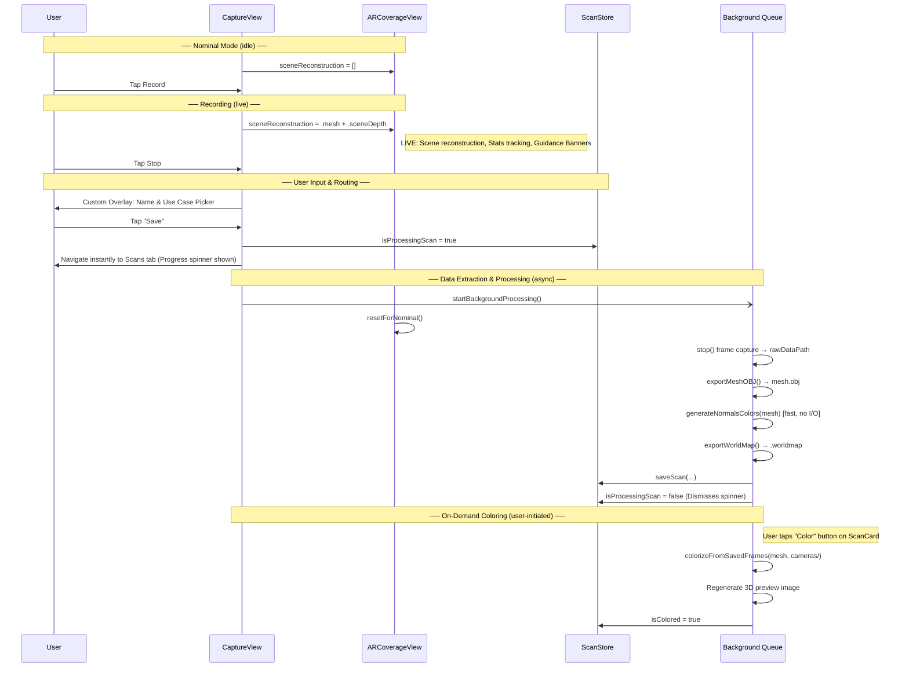
```mermaid
sequenceDiagram
    participant U as User
    participant CV as CaptureView
    participant AR as ARCoverageView
    participant SS as ScanStore
    participant BG as Background Queue

    Note over U,AR: ── Nominal Mode (idle) ──
    CV->>AR: sceneReconstruction = []

    U->>CV: Tap Record
    Note over U,AR: ── Recording (live) ──
    CV->>AR: sceneReconstruction = .mesh + .sceneDepth
    Note right of AR: LIVE: Scene reconstruction, Stats tracking, Guidance Banners

    U->>CV: Tap Stop
    Note over U,SS: ── User Input & Routing ──
    CV->>U: Custom Overlay: Name & Use Case Picker
    U->>CV: Tap "Save"
    CV->>SS: isProcessingScan = true
    CV->>U: Navigate instantly to Scans tab (Progress spinner shown)

    Note over CV,BG: ── Data Extraction & Processing (async) ──
    CV-)BG: startBackgroundProcessing()
    AR->>AR: resetForNominal()
    BG->>BG: stop() frame capture → rawDataPath
    BG->>BG: exportMeshOBJ() → mesh.obj
    BG->>BG: generateNormalsColors(mesh) [fast, no I/O]
    BG->>BG: exportWorldMap() → .worldmap
    BG->>SS: saveScan(...)
    BG->>SS: isProcessingScan = false (Dismisses spinner)

    Note over CV,BG: ── On-Demand Coloring (user-initiated) ──
    Note right of BG: User taps "Color" button on ScanCard
    BG->>BG: colorizeFromSavedFrames(mesh, cameras/)
    BG->>BG: Regenerate 3D preview image
    BG->>SS: isColored = true
```

### REQ-003: Scan4D (Rescan & Link Adjacent — Temporal & Spatial Capture)
| | |
|:--|:--|
| **Status** | ✅ Complete (Phase 1 — Local) |
| **Description** | Enable two complementary scanning intents — **Rescan Space** (*temporal*: re-capture the same area over time) and **Link Adjacent Space** (*spatial*: capture a neighboring area and stitch the chunks) — both powered by `ARWorldMap` relocalization and a ghost-mesh overlay. Provide conditional UI for specific capture sources. The spatial path joins chunks at a shared boundary anchor, dropped mid-session via **Pin & Extend** or matched cross-session via a guided alignment overlay — see REQ-012 for the boundary-anchor / `stitching.json` link layer that pairs the chunks for server-side alignment. |
| **Details** | **Use Case 1 — Time-Series Re-Scan:** Scan the same space again at a later time. The ghost overlay shows the original capture area; the user re-scans the identical region. The backend pipeline can diff or merge these scans to track changes over time. **Use Case 2 — Adjacent-Space Stitching:** Continue a scan into an adjacent area. The user moves to the edge of the ghost overlay and begins recording, overlapping slightly with the previous scan. The backend pipeline stitches the chunks together to build a single unified model. Both use cases share identical device-side mechanics: (1) **Intent Declaration:** The workflow intent (Rescan vs Link Adjacent) is explicitly chosen by the user in the initial save dialog (`ScanCase` picker). (2) **Relocalization Setup:** Tapping **Rescan Space** or **Link Adjacent Space** on any scan card loads that scan's `ARWorldMap` as the AR session initialization target. (3) **Ghost Visualization:** The selected scan's mesh renders as a configurable ghost-mesh overlay (default: magenta, adjustable in Settings). (4) **UI Prompting:** Live tracking banners instruct the user to "Move camera to relocalize" until the world map successfully aligns. |
| **Source** | [CaptureView+Extend.swift](wisescan-ios/CaptureView+Extend.swift) — Pin & Extend (mid-session) · [CaptureView+Alignment.swift](wisescan-ios/CaptureView+Alignment.swift) + [AlignmentOverlayView.swift](wisescan-ios/AlignmentOverlayView.swift) — Link Adjacent (cross-session) · [ARCoverageView.swift](wisescan-ios/ARCoverageView.swift) — `makeFreshConfiguration()`, ghost-mesh overlay, relocalization |

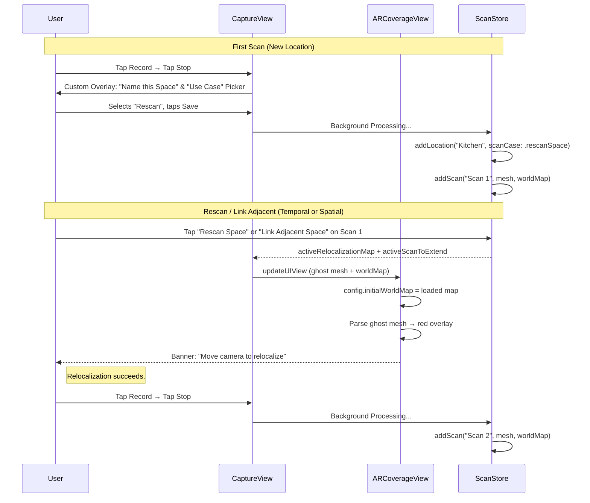
```mermaid
sequenceDiagram
    participant U as User
    participant Cap as CaptureView
    participant AR as ARCoverageView
    participant SS as ScanStore

    Note over U,SS: First Scan (New Location)
    U->>Cap: Tap Record → Tap Stop
    Cap->>U: Custom Overlay: "Name this Space" & "Use Case" Picker
    U->>Cap: Selects "Rescan", taps Save
    Cap->>SS: Background Processing...
    SS->>SS: addLocation("Kitchen", scanCase: .rescanSpace)
    SS->>SS: addScan("Scan 1", mesh, worldMap)

    Note over U,SS: Rescan / Link Adjacent (Temporal or Spatial)
    U->>SS: Tap "Rescan Space" or "Link Adjacent Space" on Scan 1
    SS-->>Cap: activeRelocalizationMap + activeScanToExtend
    Cap->>AR: updateUIView (ghost mesh + worldMap)
    AR->>AR: config.initialWorldMap = loaded map
    AR->>AR: Parse ghost mesh → red overlay
    AR-->>U: Banner: "Move camera to relocalize"
    Note right of U: Relocalization succeeds.
    U->>Cap: Tap Record → Tap Stop
    Cap->>SS: Background Processing...
    SS->>SS: addScan("Scan 2", mesh, worldMap)
```

### REQ-004: Privacy Filtering
| | |
|:--|:--|
| **Status** | ✅ Complete |
| **Description** | Person segmentation removes humans from the mesh and zeroes them out of depth maps. All three privacy outputs (live indicator, saved JPEG blur, depth cutout) are driven by ARKit's already-computed `.personSegmentationWithDepth` stencil (`ARFrame.segmentationBuffer`), **not** a separate per-frame Vision pass (the old `.accurate VNGeneratePersonSegmentationRequest` cost 180–360 ms/frame and starved VIO — see REQ-027). **Live indicator:** a cheap **red-eye marker** per detected person, rendered over the camera feed — no Vision, no CoreImage render; a retained confidence grid (`PrivacyEyeTracker`) debounces the markers so they don't flicker. **Saved JPEGs (the actual guarantee):** person regions are pixelated from the stencil; a **Vision fallback** (`pixelatePersonsAndGetFaceCenters`) covers any frame where the stencil is unavailable (unsupported device / momentary gap) so a detected person is never written unblurred. **3D anchors:** one confidence-weighted, observation-gated body-center centroid **per person** (union-find–merged from the stencil, not per grid cell), unprojected against the 16-bit depth buffer; these `face_anchors` bypass mesh inclusion and mark the preview mesh as red indicators before the server deletes the bodies downstream. Persistent toggle via `@AppStorage`. The capture view is locked to portrait for consistent orientation alignment across the RealityKit scene, the overlay, and scene geometry (see REQ-026). |
| **Source** | [ARCoverageView.swift](wisescan-ios/ARCoverageView.swift) — `privacyFilter`, stencil-based mesh/point-cloud exclusion · [FaceBlurOverlay.swift](wisescan-ios/FaceBlurOverlay.swift) — `PrivacyEyeOverlay`, `PrivacyEyeTracker`, `PrivacyBlurUtil.pixelatePersonsWithMask()` / `pixelatePersonsAndGetFaceCenters()` (fallback) · [FrameCaptureSession.swift](wisescan-ios/FrameCaptureSession.swift) — privacy-aware frame capture + 3D anchor accumulation |

### REQ-005: 3D Scan Preview
| | |
|:--|:--|
| **Status** | ✅ Complete |
| **Description** | Interactive SceneKit preview. Initially displays normals-based coloring (standard tangent-space mapping: R=X, G=Y, B=Z). On-demand "Color" button triggers camera-sampled vertex coloring using up to 150 frames with a 150mm Depth Occlusion Culling threshold to prevent color bleeding through walls. Parses `scan4d_metadata.json` to spawn 3D Privacy Markers. Falls back to height-gradient coloring when no colors.bin exists. |
| **Source** | [MeshPreviewView.swift](wisescan-ios/MeshPreviewView.swift) · [VertexColorAccumulator.swift](wisescan-ios/VertexColorAccumulator.swift) — `generateNormalsColors()`, `colorizeFromSavedFrames()` |

### REQ-006: Export Formats & Backend Ingestion
| | |
|:--|:--|
| **Status** | ✅ Complete |
| **Description** | Each export format includes only the data relevant to that format. Scan4D bundles metadata + relocalization + Polycam payload. Polycam exports raw import data. RAW exports Nerfstudio-compatible poses. OBJ exports the raw mesh file. PLY and USDZ are converted from OBJ on-device via `MeshConverter`. |
| **Source** | [ARCoverageView.swift](wisescan-ios/ARCoverageView.swift) — `exportMeshOBJ()` · [FrameCaptureSession.swift](wisescan-ios/FrameCaptureSession.swift) — `writeTransformsJSON()` · [ScansListView.swift](wisescan-ios/ScansListView.swift) — `prepareExport()` · [MeshConverter.swift](wisescan-ios/MeshConverter.swift) — `objToPLY()`, `objToUSDZ()` |

### REQ-007: Save & Upload
| | |
|:--|:--|
| **Status** | ✅ Complete |
| **Description** | Save to Files via share sheet. HTTP PUT upload to configurable URL with status tracking (pending → uploading → success/failed). ZIP packaging for RAW/Polycam. On successful upload (HTTP 2xx), `lastUploadedAt` is stamped with the current date/time and persisted via SwiftData. The ScanCard displays the uploaded date for server cross-reference. Location tiles show a **three-state upload badge**: no icon (nothing uploaded), dimmed cloud-check (some scans uploaded), solid cloud-check (all uploaded). Save and upload are **gated on post-processing** (REQ-032), and every export/upload path — per-card and bulk — carries a **re-entrancy guard** (`UploadStatus.isInFlight`) so a double-tap can't run two concurrent export pipelines (an OOM source on 72-frame blur passes). Bulk Process shows per-tile progress. |
| **Source** | [ScansListView.swift](wisescan-ios/ScansListView.swift) — `ScanCard`, `uploadScan()`, `saveToFiles()`, three-state badge, bulk guards · [StitchGraphView.swift](wisescan-ios/StitchGraphView.swift) — badge on graph tiles · [LocationDetailView.swift](wisescan-ios/LocationDetailView.swift) — `bulkUpload()` · [ScanStore.swift](wisescan-ios/ScanStore.swift) — `UploadStatus.isInFlight` |

### REQ-008: Server Status & Settings
| | |
|:--|:--|
| **Status** | ✅ Complete |
| **Description** | Dashboard shows server reachability via HTTP HEAD. Settings for upload URL, overlap %, blur rejection. In-app workflow guide. |
| **Source** | [DashboardView.swift](wisescan-ios/DashboardView.swift) · [SettingsView.swift](wisescan-ios/SettingsView.swift) |

### REQ-009: Scan Capture Data
| | |
|:--|:--|
| **Status** | ✅ Complete |
| **Description** | Adaptive-rate RGB frames (JPEG), 16-bit depth maps (PNG, mm), and camera poses. Overlap-based frame selection with motion blur rejection and real-time centered UI toast warnings for excessive motion. Features a fully isolated sequential `ioQueue` guaranteeing 1:1 parity between image, depth, and transform JSON drops natively bypassing async races. |
| **Source** | [FrameCaptureSession.swift](wisescan-ios/FrameCaptureSession.swift) — `captureFrame()`, `cameraMovement()` |

### REQ-010: Coverage Overlay
| | |
|:--|:--|
| **Status** | 🗑️ Removed |
| **Description** | Originally a 2D overlay using anchor bounding-box convex hulls and negative masking with a tiled image pattern. This feature and its assets (`CoverageMask`) were entirely removed to simplify the codebase in favor of native LiDAR mesh visualizing. |
| **Source** | N/A |
| **Assets** | N/A |

### REQ-011: Persistent Scan Storage
| | |
|:--|:--|
| **Status** | ✅ Complete |
| **Description** | SwiftData/SQLite for on-disk location and lightweight scan metadata. Binary assets are saved directly to file URLs on disk. |
| **Source** | [ScanStore.swift](wisescan-ios/ScanStore.swift) — `ScanFileManager`, `@Model ScanLocation`, `@Model CapturedScan` |

### REQ-012: Map Stitching and Coverage
| | |
|:--|:--|
| **Status** | ✅ Complete (Phase 1 — Local link layer) |
| **Description** | Prevent localized mesh limits from capping scan size by supporting both time-series re-scans and adjacent spatial mapping, and by recording an explicit **boundary-anchor link** between adjacent chunks for server-side alignment. |
| **Details** | **Unbounded chaining:** There is no upper limit on how many scans can exist inside a single Location; the old "Keep Last 2" retention limit was removed because all scans in a chain are needed to reconstruct the master scene (scans are deleted manually or purged on successful upload). **Two link flows:** *Pin & Extend* (mid-session) drops a boundary pin, auto-saves the current scan, resets ARKit, and starts a fresh session whose origin `[0,0,0]` is the boundary — no interaction beyond the initial tap. *Link Adjacent* (cross-session, from the location detail) loads the prior world map read-only, shows an alignment overlay (distance indicator + tracking state) guiding the user back to the boundary anchor, then drops a matching pin and starts fresh. **`stitching.json` manifest:** each link is a `Codable` `StitchingLink` pairing source/target `{location, scan, anchor}` IDs, both 4×4 anchor transforms, per-end compass headings, a timestamp, and a `LinkType` (`.midSession` / `.crossSession`). The manifest is written per-location and bundled in every Scan4D export zip so uploads are self-contained. Writes are deferred until the target scan ID exists (see the deferred-write contract in CONTRIBUTING.md). **Visualization:** the Scans list surfaces a node-graph of linked scans (connected components, boundary edges) and a combined-mesh viewer that loads every linked scan into one SceneKit scene, optionally tinted per source map. |
| **Source** | [StitchingMetadata.swift](wisescan-ios/StitchingMetadata.swift) — `StitchingLink`, `LinkType`, `StitchingMetadataManager` (async `write`/`addLink`, sync `read`/`hasLinks`) · [CaptureView+Extend.swift](wisescan-ios/CaptureView+Extend.swift) / [CaptureView+Alignment.swift](wisescan-ios/CaptureView+Alignment.swift) — link flows · [StitchGraphModel.swift](wisescan-ios/StitchGraphModel.swift) + [StitchGraphView.swift](wisescan-ios/StitchGraphView.swift) — linked-scan graph · [CombinedMeshView.swift](wisescan-ios/CombinedMeshView.swift) — combined-mesh viewer · [ScansListView.swift](wisescan-ios/ScansListView.swift) — entry points |
| **Notes** | The device only captures and annotates the boundary link; final alignment (ICP / photogrammetry) is a server-side concern (see Anchoring Strategy). Implementation invariants live in CONTRIBUTING.md → "Stitching / Scan Linking — Implementation Contract". |

### REQ-013: Developer Mode
| | |
|:--|:--|
| **Status** | ✅ Complete |
| **Description** | Toggleable debugging section in Settings with persistent `@AppStorage` switches: synthetic IMU / camera / depth injection for Simulator testing, Perf Diagnostics, and Pause VR Compute. A persistent orange banner across all tabs indicates dev mode and taps-to-disable (auto-scrolls to the Settings section). (The former "Flip Camera" front/back toggle was removed — person-segmentation privacy is now trivially tested by putting a hand or foot in frame on the rear camera.) |
| **Source** | [SettingsView.swift](wisescan-ios/SettingsView.swift) — `developerMode` + dev toggles · [ContentView.swift](wisescan-ios/ContentView.swift) — banner overlay · [PerfDiag.swift](wisescan-ios/PerfDiag.swift) — diagnostics |

### REQ-014: Scan Capacity Metrics
| | |
|:--|:--|
| **Status** | ✅ Complete |
| **Description** | Live HUD showing polygon count, anchor count (~area), drift level, and session duration. Composite capacity score (0–1) using `max(polygonPressure, memoryPressure, anchorPressure, driftEstimate)`. Color-coded progress bar (green→yellow→red). Capacity warnings are now surfaced through the unified ScanCoach system (REQ-029) at WARNING priority. Memory tracks delta from session baseline, not absolute footprint. |
| **Source** | [ScanStore.swift](wisescan-ios/ScanStore.swift) — `ScanStats.capacityScore`, `currentMemoryUsageMB()` · [ARCoverageView.swift](wisescan-ios/ARCoverageView.swift) — `Coordinator.updateStats()`, drift tracking · [CaptureView.swift](wisescan-ios/CaptureView.swift) — redesigned HUD · [ScanCoach.swift](wisescan-ios/ScanCoach.swift) — `warning.nearCapacity`, `warning.atCapacity` tips |
| **Design Doc** | [Scan4D_Architecture.md](docs/design/Scan4D_Architecture.md) — "Large-Space Scanning & Map Stitching" section |

### REQ-015: Location Rename
| | |
|:--|:--|
| **Status** | ✅ Complete |
| **Description** | In Edit mode, location group names become tappable (orange with pencil icon) to trigger a rename alert with text field. Saves directly to SwiftData. |
| **Source** | [ScansListView.swift](wisescan-ios/ScansListView.swift) — `showRenameAlert`, `locationToRename` |

### REQ-017: Wearable Proxy
| | |
|:--|:--|
| **Status** | ✅ Complete |
| **Description** | Proxy Mode Data Collection connects to Meta Ray-Ban glasses using the Meta Wearables DAT SDK. Connections are managed in the background via the dashboard's connection card. Listens for hardware shutter button presses to start/stop recordings and streams RGB frames natively into the app, eliminating the need for a WebRTC receiver loop. Includes a 15 FPS manual rate limiter to prevent massive proxy image bloat, strict frame-isolation by saving Wearable frames to a separate `proxy_images/` directory in the export payload, and an immediate session teardown mechanism when unregistering to prevent stale UI state. |
| **Source** | `MetaWearableManager.swift` (SDK Lifecycle) · `FrameCaptureSession.swift` (Frame Ingestion) · `ScansListView.swift` (Zipping/Export Management) |

### REQ-025: VR Capture Mode
| | |
|:--|:--|
| **Status** | ✅ Complete |
| **Description** | Alternative capture mode that replaces the AR camera passthrough with a live depth point cloud rendered on a black background using Metal shaders. Toggled via `CaptureMode` enum in Settings (AR vs VR). In VR mode: ARView background is set to `.color(.black)`, `PointCloudManager` creates billboard quads from LiDAR `sceneDepth` at 256×192 resolution, colored by the camera feed via a GPU compute kernel. Mesh wireframes are disabled; point cloud entities replace them as the scene geometry layer. Privacy segmentation overlay still operates identically (same orientation architecture applies). Requires LiDAR hardware and `ARWorldTrackingConfiguration.supportsFrameSemantics(.sceneDepth)`. |
| **Source** | [ARCoverageView.swift](wisescan-ios/ARCoverageView.swift) — `captureMode`, VR setup/teardown · [PointCloudManager.swift](wisescan-ios/PointCloudManager.swift) — `setup()`, `updatePointCloud()` · [Shaders/PointCloud.metal](wisescan-ios/Shaders/PointCloud.metal) — vertex/fragment shaders · [AppConstants.swift](wisescan-ios/AppConstants.swift) — `CaptureMode` enum · [SettingsView.swift](wisescan-ios/SettingsView.swift) — capture mode picker |

### REQ-026: Orientation Locking
| | |
|:--|:--|
| **Status** | ✅ Complete |
| **Description** | The capture view is locked to portrait orientation during scanning to ensure consistent alignment between three independent rendering layers: (1) the RealityKit scene (camera feed in AR or point cloud in VR), (2) the privacy segmentation overlay (SwiftUI), and (3) scene geometry (mesh wireframe in AR, point cloud in VR). Without this lock, the privacy overlay can appear rotated 90°/180° relative to the actual person position because ARKit's `capturedImage` is always in landscape-right sensor coordinates regardless of device orientation. The lock is implemented via `AppDelegate.orientationLocked` (runtime `supportedInterfaceOrientations`) and portrait-only `UISupportedInterfaceOrientations` in the project settings. iPadOS Stage Manager can override this lock, but the overlay handles it gracefully via `scaledToFill().clipped()`. |
| **Source** | [CaptureView.swift](wisescan-ios/CaptureView.swift) — `onAppear`/`onDisappear` orientation lock · [AppDelegate.swift](wisescan-ios/AppDelegate.swift) — `orientationLocked` · [FaceBlurOverlay.swift](wisescan-ios/FaceBlurOverlay.swift) — full orientation architecture documentation |
| **TODO** | Apple will eventually require all-orientation support on iPad (`UIRequiresFullScreen` deprecation). See FaceBlurOverlay.swift orientation architecture comments for migration plan. |

### REQ-027: Capture Performance, Session Lifecycle & VIO Integrity
| | |
|:--|:--|
| **Status** | ✅ Complete |
| **Description** | Guarantees that reality capture does not stall the main thread or starve ARKit's visual-inertial odometry (VIO), which otherwise produces multi-second freezes and drifted geometry (`ARSession ... is retaining N ARFrames`). **(1) Off-main delegate:** `session.delegateQueue` is a serial background queue; RealityKit/SwiftUI mutations are dispatched to main, delegate-owned dicts/counters stay on the delegate queue. **(2) Off-main capture I/O:** per-frame writes, encodes, mesh + world-map export run off main; at stop, capture is paused on main then flushed on a utility queue, and the capture screen is left before the name prompt so the keyboard never renders over a live `ARView`. **(3) Backlog guard:** capture coalesces and won't enqueue a new save while a prior encode is in flight (`AppConstants.maxFramesInFlight`), capping retained `CVPixelBuffer`s. **(4) Single segmentation source:** privacy blur/anchors/indicator reuse ARKit's `.personSegmentationWithDepth` stencil instead of a per-frame Vision pass (see REQ-004). **(5) Warm session + battery:** the session is kept warm between scans (a cold start costs ~13 s and blocks main on pre-A14 devices); an idle timer (`AppConstants.arIdleTeardownSeconds`) pauses it only after the user leaves the capture tab, and resume re-runs the nominal config with no main stall. Leaving the capture tab abandons an in-progress Extend; re-tap Extend to restore the ghost. **(6) Cross-scan anchor hygiene:** a new scan's record-start runs with `.removeExistingAnchors` so a prior scan's mesh can't bleed into its export; an extend preserves anchors. **(7) VIO guard:** sustained tracking loss or a frame-delivery gap mid-recording (`vioFrameGapTripSeconds` / `vioDegradedTripSeconds`) halts capture with a "Tracking Lost" alert (Save Anyway / Discard — no Continue, so good and post-loss frames are never mixed). **(8) World-map integrity:** a failed `getCurrentWorldMap` is surfaced (Try Again / Save Without Map) rather than silently saving a non-relocalizable scan. All of this is observable via **PerfDiag** (Developer Mode → Perf Diagnostics): `MainThreadWatchdog`, ARKit frame-gap + tracking-state logger, I/O backlog counter, GPU/voxel timings — OSLog subsystem `org.arenaxr.scan4d` + `os_signpost`. |
| **Source** | [ARCoverageView.swift](wisescan-ios/ARCoverageView.swift) — off-main delegate, VIO guard, `.removeExistingAnchors`, battery pause/resume · [CaptureView.swift](wisescan-ios/CaptureView.swift) — off-main stop/flush, idle-teardown timer, world-map prompt, `handleVIOCompromised()` · [FrameCaptureSession.swift](wisescan-ios/FrameCaptureSession.swift) — backlog guard, off-main encodes · [PerfDiag.swift](wisescan-ios/PerfDiag.swift) — diagnostics · [AppConstants.swift](wisescan-ios/AppConstants.swift) — `maxFramesInFlight`, `arIdleTeardownSeconds`, `vioFrameGapTripSeconds`, `vioDegradedTripSeconds` |
| **Notes** | Dead end (do not retry): tearing down or pausing the session for battery *while the delegate was on main* caused ~13 s cold-start freezes on open and stop. Moving the delegate off main is the prerequisite that made the idle-pause viable. |

---

## Planned Features

| ID | Feature | Description | Priority |
|:---|:--------|:------------|:---------|
| REQ-016 | Server Discovery | Detect local Prefect servers via mDNS/Bonjour | Medium |
| REQ-018 | Streaming Mode | Real-time lower-res tracking data to server | Medium |
| REQ-019 | Workflow Orchestration | Select preset server pipelines (Mesh, Splat, Spatial Indexing) | High |
| REQ-020 | Job Observability | Display remote Prefect job status locally | Medium |
| ~~REQ-021~~ | ~~Scan4D Ghost Overlay~~ | ✅ **Implemented** — Red translucent overlay renders previous scan during Rescan / Link Adjacent | — |
| REQ-022 | Scan4D Ground Truth Offset | Capture GPS or AprilTag data alongside scans for backend alignment seeding | High |
| REQ-023 | OpenFLAME Live Relocalization | Use backend server to stream visual localization back to device, bypassing ARKit maps | Low |
| ~~REQ-024~~ | ~~Large-Space Map Stitching~~ | ✅ **Implemented (client-side)** — Pin & Extend / Link Adjacent chunking with shared coordinate frames + boundary-anchor `stitching.json` links, graph + combined-mesh views; server-side alignment is downstream. See REQ-012 | — |
| REQ-025 | VR Capture Mode | ✅ **Implemented** — see REQ-025 below | — |
| REQ-026 | Orientation Locking | ✅ **Implemented** — see REQ-026 below | — |
| REQ-027 | Capture Performance, Session Lifecycle & VIO Integrity | ✅ **Implemented** — see REQ-027 below | — |
| REQ-028 | Semantic Labeling | ✅ **Implemented** — see REQ-028 below | — |
| REQ-029 | Scan Coaching | ✅ **Implemented** — see REQ-029 below | — |
| REQ-030 | Space Staging Analyzer | ✅ **Implemented** — see REQ-030 below | — |
| REQ-031 | Capture Quality (Hi-Res Stillness Keyframes) | ✅ **Implemented** — see REQ-031 below | — |
| REQ-032 | Post-Save Processing & Plane Registration | ✅ **Implemented** — see REQ-032 below | — |
| REQ-033 | 360° Still Source (Ricoh Theta) | ✅ **Implemented** — see REQ-033 below | — |

---

### REQ-028: Semantic Labeling
| | |
|:--|:--|
| **Status** | ✅ Complete |
| **Description** | Apple **RoomPlan** API integration for live semantic labeling and data export. Replaces the previous per-face `ARMeshClassification` approach (greedy AABB merge of per-anchor face labels) with RoomPlan's oriented bounding boxes. **(1) AR/VR live rendering:** oriented wireframe edge outlines (12 thin boxes per detected element, 10mm thickness) rendered with `UnlitMaterial`. Surfaces (walls, floors, doors, windows, openings) and objects (tables, chairs, beds, etc.) are rendered with per-category colors from `SemanticClass` (documented for users in the guide's Semantic Colors legend). Live per-surface outline geometry was removed by the deferred-build migration to cut during-scan memory; capture now collects class metadata only, and the colors appear in the mesh preview + HUD. Throttled at 500ms. `RoomCaptureSession` shares the existing `ARSession` (`pauseARSession: false` on stop to preserve tracking). **(2) Export:** `roomplan.json` sidecar with per-surface and per-object oriented bounding boxes (dimensions + 4×4 column-major transform + confidence). `roomplan_raw.json` contains Apple's native `CapturedRoom` Codable for round-tripping. **(3) 3D Preview:** `MeshPreviewView` parses `roomplan.json`, reconstructs oriented wireframe boxes via `buildOrientedBoxLineGeometry`, renders as SceneKit `.line` geometry. Toggle via toolbar button + color legend overlay. Always shows all classes regardless of capture-time filter. **(4) HUD:** colored-dot + label row showing all detected classes during recording. **(5) Configuration:** the Semantic Labeling toggle gates the whole pipeline (Developer Mode adds a kill-switch); the former per-class visibility toggles were removed along with live outline rendering — all detected classes are always shown and exported, and the class colors + descriptions moved to the user guide's Semantic Colors section. |
| **Source** | [ARCoverageView.swift](wisescan-ios/ARCoverageView.swift) — `RoomCaptureSession` lifecycle, `renderRoomPlanOutlines`, `addWireframeEdges` · [AppConstants.swift](wisescan-ios/AppConstants.swift) — `SemanticClass` enum with RoomPlan category mappings + color palette · [RoomPlanExporter.swift](wisescan-ios/RoomPlanExporter.swift) — `roomplan.json` + `roomplan_raw.json` writer · [MeshPreviewView.swift](wisescan-ios/MeshPreviewView.swift) — `buildRoomPlanOutlines` + oriented wireframe rendering + legend · [CaptureView.swift](wisescan-ios/CaptureView.swift) — HUD class dots + labels · [SettingsView.swift](wisescan-ios/SettingsView.swift) — Semantic Labeling toggle + Developer Mode kill-switch · [UserGuideView.swift](wisescan-ios/UserGuideView.swift) — Semantic Colors legend · [ScanExportManager.swift](wisescan-ios/ScanExportManager.swift) — Scan4D ZIP inclusion |
| **Notes** | RoomPlan provides oriented bounding boxes with instance-level detection (separate chairs are separate objects). Edge wireframes may be partially occluded by co-planar mesh geometry; a future improvement could use a custom Metal shader with depth-test disabled for surface outlines. |

---

### REQ-029: Scan Coaching
| | |
|:--|:--|
| **Status** | ✅ Complete |
| **Description** | Unified 4-tier priority coaching system replacing the previous inline warning pills ("slow down", "hold steady") and capacity warning banner. A standalone `@Observable` rules engine (`ScanCoach`) evaluates live scan data at ~1Hz on a background queue and produces a single highest-priority `CoachTip`. **Tiers:** `CRITICAL` (red — tracking lost/degraded, stays until resolved), `WARNING` (orange — fast motion, near/at capacity, auto-dismiss 8s), `GUIDANCE` (indigo — scan pattern hints like "scan all walls", "vary height", semantic tips, auto-dismiss 6s, 30s cooldown), `INFO` (green — progress encouragement, auto-dismiss 5s, 60s cooldown). **Anti-nag:** per-tip cooldowns, session-scoped dismiss counts (suppressed after 2 manual dismissals), swipe-up-to-dismiss gesture. **Spatial analysis:** camera extent, height variance, and movement pattern ratio computed from recent transforms. **Semantic tips** (walls/floors/objects) use live `CapturedRoom` data when Semantic Labeling is enabled. **Settings toggle:** `Scan Coaching` (default ON) suppresses GUIDANCE/INFO; CRITICAL/WARNING always evaluate. **UI:** `CoachBarView` renders a color-coded bar above the bottom HUD with SF Symbol icon + message text. The centered "relocalize" and "move to start mesh" pills are kept as standalone elements. |
| **Source** | [ScanCoach.swift](wisescan-ios/ScanCoach.swift) — rules engine, `CoachTip`, `TipPriority`, spatial helpers · [CoachBarView.swift](wisescan-ios/CoachBarView.swift) — SwiftUI coach bar with swipe-to-dismiss · [CaptureView.swift](wisescan-ios/CaptureView.swift) — `evaluateScanCoach()`, `.onChange` triggers, `CoachBarView` integration · [CaptureView+Recording.swift](wisescan-ios/CaptureView+Recording.swift) — `scanCoach.reset()` on `startRecording` · [AppConstants.swift](wisescan-ios/AppConstants.swift) — tuning constants (`coachEvaluationInterval`, cooldowns, auto-dismiss durations) · [ScanStore.swift](wisescan-ios/ScanStore.swift) — `ScanStats.roomPlanInstruction` · [ARCoverageView.swift](wisescan-ios/ARCoverageView.swift) — RoomPlan instruction forwarding · [FrameCaptureSession.swift](wisescan-ios/FrameCaptureSession.swift) — `recentTransforms()` accessor · [SettingsView.swift](wisescan-ios/SettingsView.swift) — Scan Coaching toggle |
---

### REQ-030: Space Staging Analyzer
| | |
|:--|:--|
| **Status** | ✅ Complete |
| **Description** | Pre-scan space analysis phase to help users stage their environment before committing to a 3D scan. An "Analyze Space" button appears near the Record button (visible during initial capture and ghost mesh phases, hidden once recording begins). When tapped, the app enters a 360° analysis mode: a temporary RoomPlan session starts (regardless of the Semantic Labeling toggle) alongside ambient light measurement and person detection via the segmentation stencil. The overlay tracks camera yaw coverage (0–360°) using ARFrame euler angles with **shortest-arc bucket fill** between consecutive frames (capped at `analysisYawMaxFillDeg`), so a normal-speed pan doesn't leave unfilled 1° gaps that force extra rotations; progress messaging is sweep-oriented with real degrees ("Keep sweeping — 152° of 360°"). Once 360° is covered a report presents; on the 30s timeout the report presents with the honest partial coverage (no faked 100%). A `ScanAnalysisReportView` modal presents results: **Lighting** (good >500 lumens / low), **Screens** (TV detected via RoomPlan / clear), **Doors** (detected via RoomPlan / clear), **People** (privacy-aware messaging: detected with Privacy ON = "masked from raw data", detected with Privacy OFF = "will appear in raw data, tip: enable Privacy Filter", clear, or skipped if detection unavailable). The Record button stays disabled until the report is dismissed, preventing accidental recordings during analysis. |
| **Source** | [SpaceAnalyzer.swift](wisescan-ios/SpaceAnalyzer.swift) — analysis engine: 360° yaw tracker, result aggregation, `SpaceAnalysisResult` model · [ScanAnalysisReportView.swift](wisescan-ios/ScanAnalysisReportView.swift) — report modal with per-check pass/warn/skip cards · [CaptureView.swift](wisescan-ios/CaptureView.swift) — `startAnalysis()`, `stopAnalysis()`, Analyze button, analysis overlay, report sheet · [ARCoverageView.swift](wisescan-ios/ARCoverageView.swift) — `isAnalyzing` binding, analysis-mode RoomPlan start/stop, ambient light forwarding, `hasPersonPixels` helper · [ScanStore.swift](wisescan-ios/ScanStore.swift) — `ScanStats` analysis fields (`ambientIntensity`, `analysisRoom`, `personDetectedDuringAnalysis`, `analysisYaw`) · [AppConstants.swift](wisescan-ios/AppConstants.swift) — tuning constants (`analysisAmbientLightThreshold`, `analysisTimeoutSeconds`, `analysisYawCompletionDeg`) |

---

### REQ-031: Capture Quality (Hi-Res Stillness Keyframes)
| | |
|:--|:--|
| **Status** | ✅ Complete |
| **Description** | Splat-optimized capture pipeline that pairs the continuous video-stream frames (depth/mesh coverage) with sharp, high-resolution still keyframes for downstream Gaussian-splat / NeRF texture detail. **Stillness detection:** pose-velocity thresholds (translational + rotational) with a confirmation window (`stillnessDurationRequired`) identify when the device is held still. **Tap-to-capture trigger:** stills never fire automatically — a shutter tap anywhere on the capture view arms the request, gated on confirmed stillness (taps while moving get a warning haptic and the reticle's "hold still" affordance). The armed request fires on the next capture tick, bypasses the stream-overlap gate (the tap is explicit intent, so a still can deliberately repeat a spot), auto-retries blurred results, and cancels if stillness breaks before it fires. **Hi-res keyframes:** on a tapped capture the app calls `ARSession.captureHighResolutionFrame` — a single still at the camera's native photo resolution (up to ~12MP) with its own pose/intrinsics — while the AR stream stays on a standard mesh-friendly video format (hiRes 16:9 *video* formats break Recon3D mesh integration on iPads). Transient hi-res failures are retried; after repeated consecutive failures (or a dropped completion, caught by a timeout watchdog) keyframes fall back to stream frames, which are still flagged `is_keyframe`. **Sharpness gating:** pose velocity confirms the *device* is still, but dim scenes force long exposures where hand tremor still blurs the photo — each hi-res still's sharpness is measured (Laplacian variance over the luma plane, on the background encode queue before the JPEG encode) and stills below `keyframeSharpnessFloor` are rejected and retried (up to `keyframeMaxRetries` per tapped request); after the budget the best capture is accepted. Exposure duration is recorded rather than gated (a dim room makes *every* still long-exposure, so gating on it would starve keyframes). Measured `sharpness` and `exposure_duration_s` are persisted per keyframe in `transforms.json`/Polycam camera JSONs so downstream can weight stills by actual quality (`blur_score`'s assumed 1.0 is unchanged). **Feedback loop:** a center `StillnessReticle` ring fills as the device settles, locks green with a "Tap for photo" hint when a tap will capture, and shows "Capturing…" while a tapped still is in flight; the accepted save triggers a shutter click + rigid haptic + white screen flash; entering stillness plays a soft chime + light haptic (audio gated by the `captureAudioEnabled` setting; haptics always on). **Three-state coverage overlay (AR mode):** green tint = unscanned, amber tint = depth captured but not photographed, clear camera feed = photo-grade. Coverage is tracked on a coarse world-space voxel grid (`PhotoCoverageGrid`, `photoCoverageVoxelSize` cells): each keyframe **stamps the grid by unprojecting its own depth map**, so only surfaces the photo actually measured are marked — occlusion-correct by construction (geometry behind a wall never enters the depth map, so it can't be marked covered through the wall — the failure mode of the earlier frustum/AABB test). An anchor drops its amber tint once ≥`photoCoverageAnchorFraction` of its mesh voxels are covered. The grid records per-voxel view-direction octants (angular diversity, secondary) and quantized camera-standpoint masks (~0.5m cells hashed to 8 bits — parallax/baseline diversity, the primary multi-view signal: rotating in place earns no credit, a sidestep does). Each stamp measures still-to-still voxel overlap (photogrammetry targets ~60%); the session's mean overlap and multi-standpoint fraction feed two additional coach nudges (`guidance.stillOverlap` "overlap your photos", `guidance.stillParallax` "step sideways") and export in the `photo_coverage` metadata block (`mean_still_overlap`, `standpoint_diversity`) for offline correlation of capture properties against splat quality. The default frame-capture overlap slider returns to 60% — with sharp stills carrying texture detail, fewer redundant motion frames are needed. The amber tint mesh is inflated ~4mm along vertex normals to avoid z-fighting the coincident occlusion fill. **Coverage-debt coaching:** when depth mesh outruns photo coverage (`photoCoverageFraction` below `photoCoverageDebtFraction` with enough geometry), ScanCoach nudges the user to hold still on the amber areas and tap. **Exports:** keyframes carry per-frame intrinsics/resolution overrides and `is_keyframe: true` in `transforms.json` and Polycam camera JSONs; `scan4d_metadata.json` records `keyframe_count` and a `photo_coverage` block (covered/occupied voxels + fraction) for backend dataset triage. HUD shows sharp/total frame counts and a Still indicator. |
| **Source** | [FrameCaptureSession.swift](wisescan-ios/FrameCaptureSession.swift) — stillness detection, `requestStillCapture` tap arming, `requestHighResolutionKeyframe`, per-frame intrinsics in `FrameData`, `onKeyframeCaptured` callback, audio/haptic feedback · [StillnessReticle.swift](wisescan-ios/StillnessReticle.swift) — ring-fill reticle view · [CaptureView.swift](wisescan-ios/CaptureView.swift) — reticle + shutter flash integration, sharp/total HUD counters · [PhotoCoverageGrid.swift](wisescan-ios/PhotoCoverageGrid.swift) — sparse world-space voxel grid, depth-unproject stamping, view-octant tracking · [ARCoverageView.swift](wisescan-ios/ARCoverageView.swift) — three-state coverage overlay: amber tint mesh, `markPhotoCoverage` grid stamping + anchor re-evaluation, `onKeyframeCaptured` wiring · [ScanCoach.swift](wisescan-ios/ScanCoach.swift) — coverage-debt pause-for-photo guidance · [VertexColorAccumulator.swift](wisescan-ios/VertexColorAccumulator.swift) — keyframe-weighted vertex coloring · [AppConstants.swift](wisescan-ios/AppConstants.swift) — tuning constants (`stillness*`, `motionBlurAngularVelocity`, `photoCoverage*`, `photoTint*`, `captureFlash*`) · [schemas/](schemas/) — `is_keyframe`, per-frame intrinsics, `keyframe_count`, `photo_coverage` schema updates |

---

### REQ-032: Post-Save Processing & Plane Registration (Canonical Frame)
| | |
|:--|:--|
| **Status** | ✅ Complete |
| **Description** | Split of the save pipeline into RAW-persist vs derived-artifact stages so heavy work never races a live AR session ("★ DECISION 3" in [fix-localization-plan.md](docs/design/fix-localization-plan.md)). **Save persists raw artifacts only** (mesh.obj, world map, frames/depth, face-classification sidecar). **Room layout builds post-save:** `CapturedRoomData` cannot be persisted (Codable in signature only), so RoomBuilder runs as a fire-and-forget post-save continuation (`DeferredRoomBuild`, armed only after `saveScan` so it can't perturb the world-map export), writing `roomplan.json`/`roomplan_raw.json` seconds after save. **Everything else finishes in the user-triggered Process step** (`ScanPostprocessor`, per-card button or bulk "Process All" with per-tile progress), run oldest-first so the location's original scan — the **canonical-frame owner** — is processed before later generations register against it: **(1) REGISTRATION** — `PlaneRegistration` solves a gravity-locked 4-DOF (yaw + XYZ) Gauss–Newton fit matching the rescan's walls/floor to the original's, with an eigenvalue **observability gate** (an unobservable solve — e.g. one wall — is refused, not guessed) and a trim-rescue pass for partial overlap. A trusted fit is **baked transactionally** into mesh.obj + roomplan.json via `SaveRegistration` (atomic mesh write → roomplan retransform with mesh rollback → `registration.json` sidecar last), so an I/O failure is always retriable; refusals are recorded in the sidecar with a version-gated retry. Rescans register; the original *is* the frame; link-adjacent scans never register (a similar adjacent room is a false-lock risk). Legacy pre-registration scans are skipped by default (dev-gated "Register Legacy Scans" re-enables). **(2) PROXY** — a lightweight ghost proxy (`mesh_proxy.obj`: walls → RoomPlan quads, content → decimated mesh) for future rescan overlays; ghost artifacts load off-main with a staleness guard. **(3) COLORIZE** — photo-based vertex coloring (setting-governed, cosmetic, never gates). **Terminal states** per scan: COMPLETE / LEGACY-CAPPED (raw input never persisted; gates pass) / ROOM PENDING (deferred build in flight; gates hold) / BAD (no room and none coming). **Hard gates:** rescan, connect-adjacent, upload, and export are blocked until processing completes (`needsPostprocess`), with re-entrancy guards on all bulk and per-card process/upload/save workers. **Bad-scan warning:** `scheduleBadScanCheck` fires shortly after save and warns the user to redo the capture while they are still in the room. **Live ghost auto-align:** during a rescan, the ghost auto-seats against live detected planes (status chip turns green on lock). |
| **Source** | [ScanPostprocessor.swift](wisescan-ios/ScanPostprocessor.swift) — pipeline, gates, bad-scan check · [PlaneRegistration.swift](wisescan-ios/PlaneRegistration.swift) — 4-DOF solver + observability gate · [SaveRegistration.swift](wisescan-ios/SaveRegistration.swift) — transactional bake + `registration.json` sidecar · [RoomPlanExporter.swift](wisescan-ios/RoomPlanExporter.swift) — roomplan sidecar writers · [CaptureView+Recording.swift](wisescan-ios/CaptureView+Recording.swift) + [ARCoverageView.swift](wisescan-ios/ARCoverageView.swift) — `DeferredRoomBuild` · [CaptureView.swift](wisescan-ios/CaptureView.swift) — off-main ghost load, live auto-align · [ScansListView.swift](wisescan-ios/ScansListView.swift) — Process buttons, per-tile bulk progress, gate UI |
| **Design Doc** | [fix-localization-plan.md](docs/design/fix-localization-plan.md) |

---

### REQ-033: 360° Still Source (Ricoh Theta)
| | |
|:--|:--|
| **Status** | ✅ Complete (Theta X full; Z1 Wi-Fi-only) |
| **Description** | A rig-mounted Ricoh Theta rides above the phone and captures a full-sphere still at every stillness pause, giving downstream reconstruction all-direction imagery the phone's frustum can't. **Connect is BLE-first** (Theta X): pick the camera from a named Bluetooth list (advertised name = serial), one-time passkey bond, identity read → derived Wi-Fi credentials, wake-from-sleep over BLE (`cameraPower=on`), then a patient Wi-Fi join/probe (retries absorb the AP's 5–15 s rise and DHCP settle). A **multi-camera roster** switches bodies per collection (X for texture, Z1 for low light); Z1 connects Wi-Fi-only pending its BLE increment (its v1 GATT needs per-session UUID auth registered over Wi-Fi). At connect the camera's shooting state is **normalized** (image mode, self-timer off, running captures stopped) and zenith correction is enforced (leveling invariant). **The shutter rides BLE when the link is up** (~1.2–1.5 s faster per still; the new file's URL arrives as a NotifyState push — the download ticket with zero polling) with OSC fallback. Capture writes a **sidecar only** (phone pose + timestamps, no camera pose); JPGs drain through a queue that yields to triggers; download state is **disk-derived** (sidecar without JPG = pending). **Rig calibration solves per scan at Process time** (EquirectPostCalibration, solver v7) against the completed mesh: yaw and elevation-offset are per-scan nuisances, dy anchors to the user-measured rig height, poses bake into every sidecar with provenance + solver version (bumps self-heal old scans). Security: camera-side originals are deleted after verified transfer (P1), Wi-Fi credentials derive from the serial with a default-password warning planned (P2). Coloring can optionally draw exclusively from cube faces cut at baked poses (dev probe for pose quality). |
| **Source** | [ThetaCameraManager.swift](wisescan-ios/ThetaCameraManager.swift) (+[+OSC](wisescan-ios/ThetaCameraManager+OSC.swift), [+ScanCapture](wisescan-ios/ThetaCameraManager+ScanCapture.swift)) — connect/roster/shutter/downloads · [ThetaBLEManager.swift](wisescan-ios/ThetaBLEManager.swift) (+[Link](wisescan-ios/ThetaBLEManager+Link.swift)/[Delegates](wisescan-ios/ThetaBLEManager+Delegates.swift)) — production BLE · [ThetaBLEProbe.swift](wisescan-ios/ThetaBLEProbe.swift) — dev GATT bench · [EquirectPostCalibration.swift](wisescan-ios/EquirectPostCalibration.swift) + [RigCalibrationSolver.swift](wisescan-ios/RigCalibrationSolver.swift) — per-scan solve · [EquirectFaceExport.swift](wisescan-ios/EquirectFaceExport.swift) + [EquirectGPU.swift](wisescan-ios/EquirectGPU.swift) — cube faces · [DashboardView.swift](wisescan-ios/DashboardView.swift) — camera card/sheet |
| **Design Doc** | [still-source-360.md](docs/design/still-source-360.md) — full decision journal (BLE probe rounds, solver history v2–v7, security plan) |

#### REQ-033 Flows

Cross-cutting invariants (every flow below preserves these):

- **Privacy fail-closed**: raw `equirect_stills/` and face frames derived from them stay
  inside `raw_data/` (commit-blocked by the privacy guard) and only exit via the export
  privacy passes.
- **Sidecar-derived state**: download/bake state lives ON DISK (sidecar + missing JPG =
  pending; `rig_calibration_source` + `_solver_version` stamp = baked). No queue store
  to desync; version bumps self-heal old scans.
- **Poses bake at Process time** from the scan's own stills against the complete mesh;
  capture records only phone pose + timestamps (boot-relative `frame_timestamp`
  labeled, wall-clock `captured_at_epoch_ms`; metric everywhere).
- **Yaw and elevation-offset are per-scan nuisances**; dy anchors to the measured rig
  height; dLat/pitch solve free inside mechanical bounds.

##### Overview

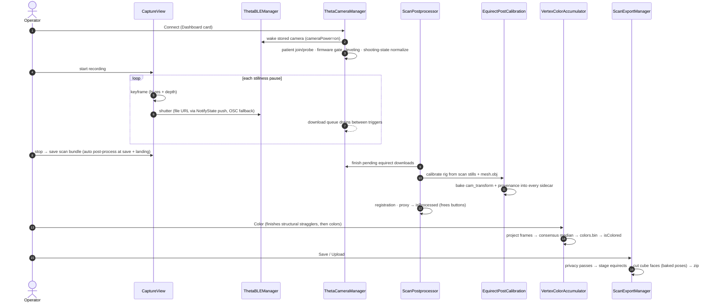
```mermaid
sequenceDiagram
    autonumber
    actor U as Operator
    participant CV as CaptureView
    participant BLE as ThetaBLEManager
    participant TCM as ThetaCameraManager
    participant PP as ScanPostprocessor
    participant CAL as EquirectPostCalibration
    participant COL as VertexColorAccumulator
    participant EXP as ScanExportManager

    U->>TCM: Connect (Dashboard card)
    TCM->>BLE: wake stored camera (cameraPower=on)
    TCM->>TCM: patient join/probe · firmware gate · leveling · shooting-state normalize
    U->>CV: start recording
    loop each stillness pause
        CV->>CV: keyframe (hi-res + depth)
        CV->>BLE: shutter (file URL via NotifyState push, OSC fallback)
        TCM-->>TCM: download queue drains between triggers
    end
    U->>CV: stop → save scan bundle (auto post-process at save + landing)
    PP->>TCM: finish pending equirect downloads
    PP->>CAL: calibrate rig from scan stills + mesh.obj
    CAL->>CAL: bake cam_transform + provenance into every sidecar
    PP->>PP: registration · proxy → isProcessed (frees buttons)
    U->>COL: Color (finishes structural stragglers, then colors)
    COL->>COL: project frames → consensus median → colors.bin → isColored
    U->>EXP: Save / Upload
    EXP->>EXP: privacy passes → stage equirects → cut cube faces (baked poses) → zip
```

##### Connect / startup

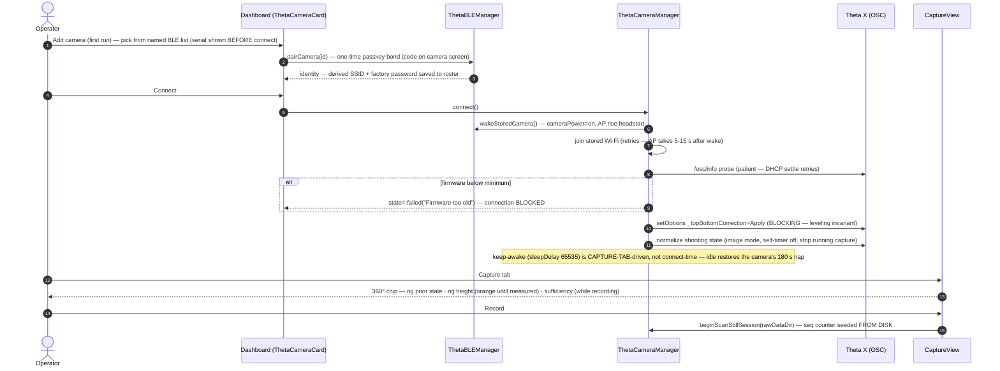
```mermaid
sequenceDiagram
    autonumber
    actor U as Operator
    participant DB as Dashboard (ThetaCameraCard)
    participant BLE as ThetaBLEManager
    participant TCM as ThetaCameraManager
    participant X as Theta X (OSC)
    participant CV as CaptureView

    U->>DB: Add camera (first run) — pick from named BLE list (serial shown BEFORE connect)
    DB->>BLE: pairCamera(id) — one-time passkey bond (code on camera screen)
    BLE-->>DB: identity → derived SSID + factory password saved to roster
    U->>DB: Connect
    DB->>TCM: connect()
    TCM->>BLE: wakeStoredCamera() — cameraPower=on, AP rise headstart
    TCM->>TCM: join stored Wi-Fi (retries — AP takes 5-15 s after wake)
    TCM->>X: /osc/info probe (patient — DHCP settle retries)
    alt firmware below minimum
        TCM-->>DB: state=.failed("Firmware too old") — connection BLOCKED
    end
    TCM->>X: setOptions _topBottomCorrection=Apply (BLOCKING — leveling invariant)
    TCM->>X: normalize shooting state (image mode, self-timer off, stop running capture)
    Note over TCM: keep-awake (sleepDelay 65535) is CAPTURE-TAB-driven, not connect-time — idle restores the camera's 180 s nap
    U->>CV: Capture tab
    CV-->>U: 360° chip — rig prior state · rig height (orange until measured) · sufficiency (while recording)
    U->>CV: Record
    CV->>TCM: beginScanStillSession(rawDataDir) — seq counter seeded FROM DISK
```

##### AR/VR capture (per stillness pause)

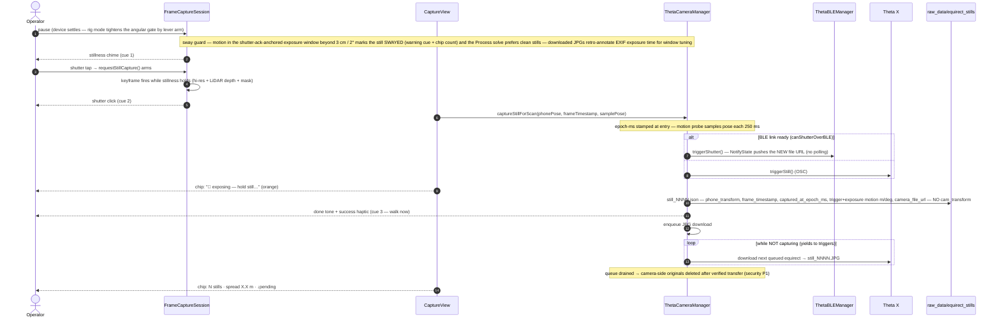
```mermaid
sequenceDiagram
    autonumber
    actor U as Operator
    participant FCS as FrameCaptureSession
    participant CV as CaptureView
    participant TCM as ThetaCameraManager
    participant BLE as ThetaBLEManager
    participant X as Theta X
    participant D as raw_data/equirect_stills

    U->>FCS: pause (device settles — rig mode tightens the angular gate by lever arm)
    Note over FCS,TCM: sway guard — motion in the shutter-ack-anchored exposure window beyond 3 cm / 2° marks the still SWAYED (warning cue + chip count) and the Process solve prefers clean stills — downloaded JPGs retro-annotate EXIF exposure time for window tuning
    FCS-->>U: stillness chime (cue 1)
    U->>FCS: shutter tap → requestStillCapture() arms
    FCS->>FCS: keyframe fires while stillness holds (hi-res + LiDAR depth + mask)
    FCS-->>U: shutter click (cue 2)
    CV->>TCM: captureStillForScan(phonePose, frameTimestamp, samplePose)
    Note over TCM: epoch-ms stamped at entry — motion probe samples pose each 250 ms
    alt BLE link ready (canShutterOverBLE)
        TCM->>BLE: triggerShutter() — NotifyState pushes the NEW file URL (no polling)
    else
        TCM->>X: triggerStill() (OSC)
    end
    CV-->>U: chip: "📸 exposing — hold still…" (orange)
    TCM->>D: still_NNNN.json — phone_transform, frame_timestamp, captured_at_epoch_ms, trigger+exposure motion m/deg, camera_file_url — NO cam_transform
    TCM-->>U: done tone + success haptic (cue 3 — walk now)
    TCM->>TCM: enqueue JPG download
    loop while NOT capturing (yields to triggers)
        TCM->>X: download next queued equirect → still_NNNN.JPG
    end
    Note over TCM: queue drained → camera-side originals deleted after verified transfer (security P1)
    CV-->>U: chip: N stills · spread X.X m · ↓pending
```

##### Stop / save

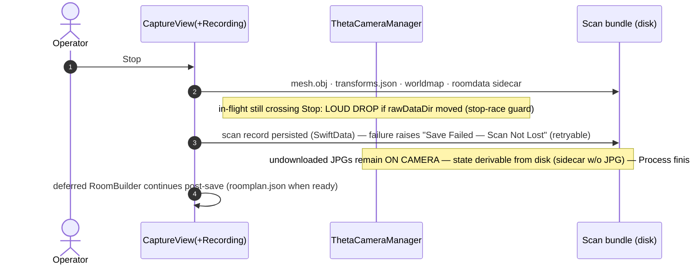
```mermaid
sequenceDiagram
    autonumber
    actor U as Operator
    participant CV as CaptureView(+Recording)
    participant TCM as ThetaCameraManager
    participant FS as Scan bundle (disk)

    U->>CV: Stop
    CV->>FS: mesh.obj · transforms.json · worldmap · roomdata sidecar
    Note over TCM: in-flight still crossing Stop: LOUD DROP if rawDataDir moved (stop-race guard)
    CV->>FS: scan record persisted (SwiftData) — failure raises "Save Failed — Scan Not Lost" (retryable)
    Note over TCM,FS: undownloaded JPGs remain ON CAMERA — state derivable from disk (sidecar w/o JPG) — Process finishes them
    CV->>CV: deferred RoomBuilder continues post-save (roomplan.json when ready)
```

##### Auto post-process (at save + on landing at Location Detail)

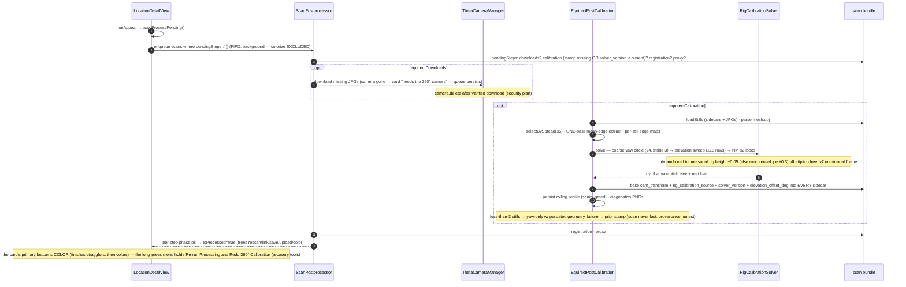
```mermaid
sequenceDiagram
    autonumber
    participant LDV as LocationDetailView
    participant PP as ScanPostprocessor
    participant TCM as ThetaCameraManager
    participant CAL as EquirectPostCalibration
    participant SOL as RigCalibrationSolver
    participant D as scan bundle

    LDV->>LDV: onAppear → autoProcessPending()
    LDV->>PP: enqueue scans where pendingSteps ≠ [] (FIFO, background — colorize EXCLUDED)
    PP->>D: pendingSteps: downloads? calibration (stamp missing OR solver_version < current)? registration? proxy?
    opt equirectDownloads
        PP->>TCM: download missing JPGs (camera gone → card "needs the 360° camera" — queue persists)
        Note over TCM: camera.delete after verified download (security plan)
    end
    opt equirectCalibration
        CAL->>D: loadStills (sidecars + JPGs) · parse mesh.obj
        CAL->>CAL: selectBySpread(≤5) · ONE-pass mesh-edge extract · per-still edge maps
        CAL->>SOL: solve — coarse yaw circle (24, stride 3) → elevation sweep (±16 rows) → NM ≤2 lobes
        Note over SOL: dy anchored to measured rig height ±0.05 (else mech envelope ±0.3), dLat/pitch free, v7 unmirrored frame
        SOL-->>CAL: dy dLat yaw pitch elev + residual
        CAL->>D: bake cam_transform + rig_calibration_source + solver_version + elevation_offset_deg into EVERY sidecar
        CAL->>CAL: persist rolling profile (sanity-gated) · diagnostics PNGs
        Note over CAL: less-than-3 stills → yaw-only w/ persisted geometry, failure → prior stamp (scan never lost, provenance honest)
    end
    PP->>D: registration · proxy
    PP-->>LDV: per-step phase pill → isProcessed=true (frees rescan/link/save/upload/color)
    Note over LDV: the card's primary button is COLOR (finishes stragglers, then colors) — the long-press menu holds Re-run Processing and Redo 360° Calibration (recovery tools)
```

##### Color (primary per-scan action)

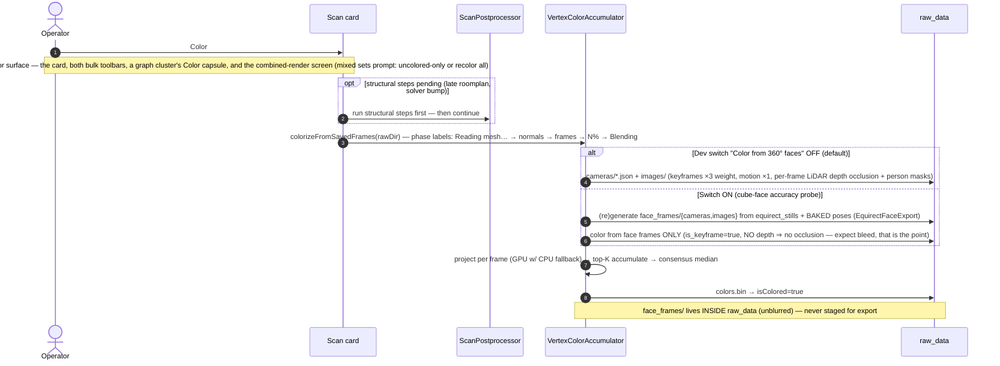
```mermaid
sequenceDiagram
    autonumber
    actor U as Operator
    participant LDV as Scan card
    participant PP as ScanPostprocessor
    participant COL as VertexColorAccumulator
    participant D as raw_data

    U->>LDV: Color
    Note over U,LDV: same path serves every Color surface — the card, both bulk toolbars, a graph cluster's Color capsule, and the combined-render screen (mixed sets prompt: uncolored-only or recolor all)
    opt structural steps pending (late roomplan, solver bump)
        LDV->>PP: run structural steps first — then continue
    end
    LDV->>COL: colorizeFromSavedFrames(rawDir) — phase labels: Reading mesh… → normals → frames → N% → Blending
    alt Dev switch "Color from 360° faces" OFF (default)
        COL->>D: cameras/*.json + images/ (keyframes ×3 weight, motion ×1, per-frame LiDAR depth occlusion + person masks)
    else Switch ON (cube-face accuracy probe)
        COL->>D: (re)generate face_frames/{cameras,images} from equirect_stills + BAKED poses (EquirectFaceExport)
        COL->>D: color from face frames ONLY (is_keyframe=true, NO depth ⇒ no occlusion — expect bleed, that is the point)
    end
    COL->>COL: project per frame (GPU w/ CPU fallback) → top-K accumulate → consensus median
    COL->>D: colors.bin → isColored=true
    Note over COL,D: face_frames/ lives INSIDE raw_data (unblurred) — never staged for export
```

##### Export / save / upload

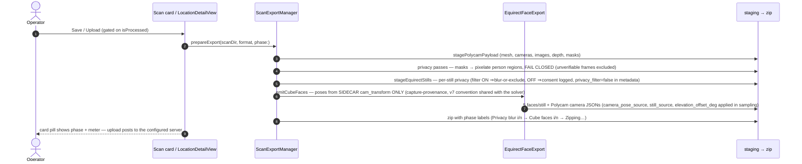
```mermaid
sequenceDiagram
    autonumber
    actor U as Operator
    participant LDV as Scan card / LocationDetailView
    participant EXP as ScanExportManager
    participant FACE as EquirectFaceExport
    participant Z as staging → zip

    U->>LDV: Save / Upload (gated on isProcessed)
    LDV->>EXP: prepareExport(scanDir, format, phase:)
    EXP->>Z: stagePolycamPayload (mesh, cameras, images, depth, masks)
    EXP->>Z: privacy passes — masks → pixelate person regions, FAIL CLOSED (unverifiable frames excluded)
    EXP->>Z: stageEquirectStills — per-still privacy (filter ON ⇒ blur-or-exclude, OFF ⇒ consent logged, privacy_filter=false in metadata)
    EXP->>FACE: emitCubeFaces — poses from SIDECAR cam_transform ONLY (capture-provenance, v7 convention shared with the solver)
    FACE->>Z: 5 faces/still + Polycam camera JSONs (camera_pose_source, still_source, elevation_offset_deg applied in sampling)
    EXP->>Z: zip with phase labels (Privacy blur i/n → Cube faces i/n → Zipping…)
    LDV-->>U: card pill shows phase + meter — upload posts to the configured server
```

Diagram maintenance: these are hand-drawn against the code (solver v7, BLE graduation
era). When a flow changes, update the diagram in the same PR — the review checklist
item is "does the mermaid still tell the truth?". Names are grep-able anchors.

---

## Data Model

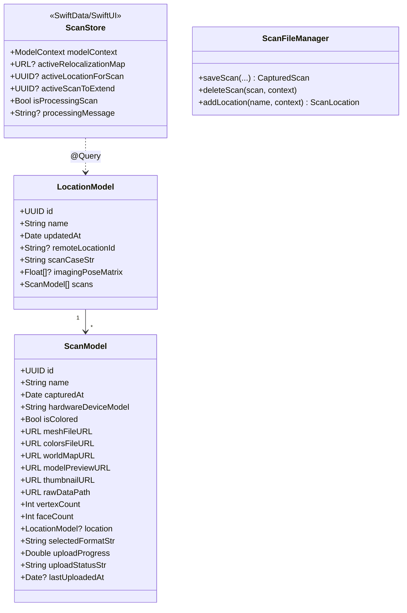
```mermaid
classDiagram
    class LocationModel {
        +UUID id
        +String name
        +Date updatedAt
        +String? remoteLocationId
        +String scanCaseStr
        +Float[]? imagingPoseMatrix
        +ScanModel[] scans
    }

    class ScanModel {
        +UUID id
        +String name
        +Date capturedAt
        +String hardwareDeviceModel
        +Bool isColored
        +URL meshFileURL
        +URL colorsFileURL
        +URL worldMapURL
        +URL modelPreviewURL
        +URL thumbnailURL
        +URL rawDataPath
        +Int vertexCount
        +Int faceCount
        +LocationModel? location
        +String selectedFormatStr
        +Double uploadProgress
        +String uploadStatusStr
        +Date? lastUploadedAt
    }

    class ScanStore {
        <<SwiftData/SwiftUI>>
        +ModelContext modelContext
        +URL? activeRelocalizationMap
        +UUID? activeLocationForScan
        +UUID? activeScanToExtend
        +Bool isProcessingScan
        +String? processingMessage
    }

    class ScanFileManager {
        +saveScan(...) CapturedScan
        +deleteScan(scan, context)
        +addLocation(name, context) ScanLocation
    }

    LocationModel "1" --> "*" ScanModel
    ScanStore ..> LocationModel : @Query
```

**Source:** [ScanStore.swift](wisescan-ios/ScanStore.swift)

---

## Anchoring Strategy (Scan4D)

| Mechanism | Role | Reliability | Best Use |
|:----------|:-----|:------------|:---------|
| **Backend ICP Alignment** | **Ultimate Truth** | ⭐⭐⭐⭐ | High-fidelity historical alignment of point clouds/splats on the server. |
| **GPS / Anchor Tags** | **Ground Truth Seed**| ⭐⭐⭐⭐⭐ | Categorical offset to give the backend a starting guess before ICP. |
| **`ARWorldMap`** | **Edge UI Guide** | ⭐⭐ | Transient local caching to power the live "ghost overlay" UI during capture. |
| OpenFLAME | Server-Assisted UI | ⭐⭐⭐ | Future upgrade for live UI guiding, streaming visual features to backend. |
| RoomPlan API | Deprioritized | ⭐⭐⭐ | Apple-locked semantic tracking; better handled off-device by the server. |

**Current implementation:** `ARWorldMap` is saved categorically and used for Edge UI relocalization. See [Design/Scan4D_Architecture.md](docs/design/Scan4D_Architecture.md) for full rationale on the Backend-First philosophy.

---

## Export Format Reference

Each format includes only its own payload — no universal base.

| Format | Extension | Contents | Target Tool |
|:-------|:----------|:---------|:------------|
| Scan4D | `.zip` | `scan4d_metadata.json`, `relocalization.worldmap`, `images/`, `depth/`, `cameras/`, `mesh_info.json` | Scan4D server workflows |
| Polycam | `.zip` | `images/`, `depth/`, `cameras/`, `mesh_info.json` | Polycam raw data import |
| RAW | `.zip` | `images/`, `depth/`, `transforms.json` | Nerfstudio, COLMAP |
| OBJ | `.obj` | Single mesh file (no vertex colors) | MeshLab, Blender |
| PLY | `.ply` | Converted mesh with embedded vertex colors | MeshLab, CloudCompare |
| USDZ | `.usdz` | Converted mesh via ModelIO | iOS Quick Look |

---

## Physical Layer Prerequisites & Failure Guards

The app operates across multiple physical channels (Bluetooth, WiFi Direct, ARKit, on-device sensors). Each channel has prerequisites that can fail independently. This section documents every prerequisite, the failure mode, and how the app guards against it.

### Prerequisite Matrix

| # | Layer | Prerequisite | Failure Mode | App Guard | Status |
|:--|:------|:-------------|:-------------|:----------|:-------|
| P-01 | iOS | Camera permission (`NSCameraUsageDescription`) | ARKit session refuses to start; no video feed | System prompt on first launch; required for any capture | ✅ Handled |
| P-02 | iOS | Location permission (`NSLocationWhenInUseUsageDescription`) | No GPS coordinates embedded in scan metadata | System prompt; scans still work without GPS but lack ground-truth anchoring | ✅ Handled |
| P-03 | iOS | Local Network permission (`NSLocalNetworkUsageDescription`) | Cannot reach self-hosted backend for upload/mDNS discovery | System prompt; offline capture still works | ✅ Handled |
| P-04 | iOS | ARKit hardware support | App cannot capture 3D data | Runtime `ARWorldTrackingConfiguration.isSupported` check | ✅ Handled |
| P-05 | iOS | LiDAR hardware | No mesh, depth, or coverage overlay | Runtime `supportsLiDAR` check → Lite Mode banner | ✅ Handled |
| P-06 | Wearable | Meta AI app installed + glasses paired | `Wearables.shared.devices` returns empty | Dashboard shows "No devices found"; device observation stream auto-retries | ✅ Handled |
| P-07 | Wearable | Developer Mode enabled on glasses | SDK registration may fail; streaming unavailable | Logged via registration state observation; user directed to Meta AI app | ⚠️ Logged only |
| P-08 | Wearable | DAT SDK app registration (via Meta AI OAuth) | `registrationState` remains unregistered | `openRegistration()` called from Dashboard; state monitored via `registrationStateStream()` | ✅ Handled |
| P-09 | Wearable | DAT SDK camera permission (granted via Meta AI) | `checkPermissionStatus(.camera)` returns denied | Warning banner: "Meta App Permission Required"; re-checks on foreground | ✅ Handled |
| P-10 | Wearable | Glasses firmware compatibility | `device.compatibility()` returns `.deviceUpdateRequired`; `DeviceSession.start()` throws `noEligibleDevice` | `deviceUpdateRequired` flag → orange CaptureView banner: "Glasses firmware update required — open Meta AI app to update" | ✅ Handled |
| P-11 | Wearable | Bluetooth connection (`linkState`) | `device.linkState` is `.disconnected` or `.connecting` | `addLinkStateListener` waits for `.connected` before creating session | ✅ Handled |
| P-12 | Wearable | WiFi Direct side-channel (SDK-managed) | Video frames cannot be delivered over Bluetooth alone; SDK internally establishes WiFi Direct for media transfer | SDK handles this transparently; phone auto-joins glasses WiFi network (e.g., "RBMeta 08NR -2") when streaming starts. Failure manifests as `noEligibleDevice` or nil frames | ⚠️ SDK-managed |
| P-13 | Wearable | Meta AI app version ≥ v254 | SDK initialization or registration may fail silently | Logged; no direct version check available in SDK | ⚠️ Logged only |
| P-14 | Wearable | SDK version ↔ firmware version match | `device.compatibility()` returns `.sdkUpdateRequired` | Logged; developer must update the SDK package | ⚠️ Logged only |
| P-15 | Wearable | `DeviceSession` reaches `.started` state | Session may hang in `.starting` or error via `errorStream` | `stateStream()` + `errorStream()` racing pattern (from official sample); timeout and cleanup on failure | ✅ Handled |
| P-16 | Wearable | `addStream()` returns non-nil | Stream cannot be created even with valid session | Logged with session state; session stopped and cleaned up | ✅ Handled |

### Wearable Streaming Lifecycle

The DAT SDK enforces a strict lifecycle. Each step must succeed before the next can proceed:

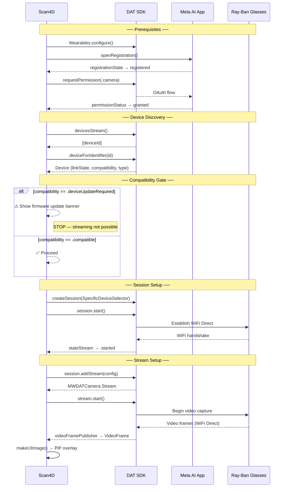
```mermaid
sequenceDiagram
    participant App as Scan4D
    participant SDK as DAT SDK
    participant AI as Meta AI App
    participant HW as Ray-Ban Glasses

    Note over App,HW: ── Prerequisites ──
    App->>SDK: Wearables.configure()
    App->>AI: openRegistration()
    AI-->>App: registrationState → registered
    App->>SDK: requestPermission(.camera)
    SDK-->>AI: OAuth flow
    AI-->>App: permissionStatus → granted

    Note over App,HW: ── Device Discovery ──
    App->>SDK: devicesStream()
    SDK-->>App: [deviceId]
    App->>SDK: deviceForIdentifier(id)
    SDK-->>App: Device (linkState, compatibility, type)

    Note over App,HW: ── Compatibility Gate ──
    alt compatibility == .deviceUpdateRequired
        App-->>App: ⚠️ Show firmware update banner
        Note right of App: STOP — streaming not possible
    else compatibility == .compatible
        App-->>App: ✅ Proceed
    end

    Note over App,HW: ── Session Setup ──
    App->>SDK: createSession(SpecificDeviceSelector)
    App->>SDK: session.start()
    SDK->>HW: Establish WiFi Direct
    HW-->>SDK: WiFi handshake
    SDK-->>App: stateStream → .started

    Note over App,HW: ── Stream Setup ──
    App->>SDK: session.addStream(config)
    SDK-->>App: MWDATCamera.Stream
    App->>SDK: stream.start()
    SDK->>HW: Begin video capture
    HW-->>SDK: Video frames (WiFi Direct)
    SDK-->>App: videoFramePublisher → VideoFrame
    App->>App: makeUIImage() → PiP overlay
```

### iOS Permission Keys

Configured in the Xcode project (`project.pbxproj` Info.plist keys):

| Key | Value | Required For |
|:----|:------|:-------------|
| `NSCameraUsageDescription` | "Camera is required for AR capture and streaming." | ARKit session, wearable proxy |
| `NSLocationWhenInUseUsageDescription` | "Scan4D requires Location data to assign a ground truth position..." | GPS metadata in scans |
| `NSLocalNetworkUsageDescription` | "Local Network is required to connect to Scan4D servers." | Backend upload, mDNS |

### Wearable Hardware Requirements

| Requirement | Minimum | Notes |
|:------------|:--------|:------|
| Glasses model | Ray-Ban Meta Gen 1/2 or Meta Ray-Ban Display | `device.deviceType()` returns `.rayBanMeta` |
| Glasses firmware | v20+ (Ray-Ban Meta), v21+ (Display) | Check via `device.compatibility()` |
| Meta AI app | v254+ | Required for registration and permission flows |
| iOS version | 15.2+ | DAT SDK minimum |
| Developer Mode | Enabled on glasses | Toggle in Meta AI app settings |

**Source:** [MetaWearableManager.swift](wisescan-ios/MetaWearableManager.swift) — `setupStreamSession()`, `updateConnectedDevices()`, `deviceUpdateRequired`

---
