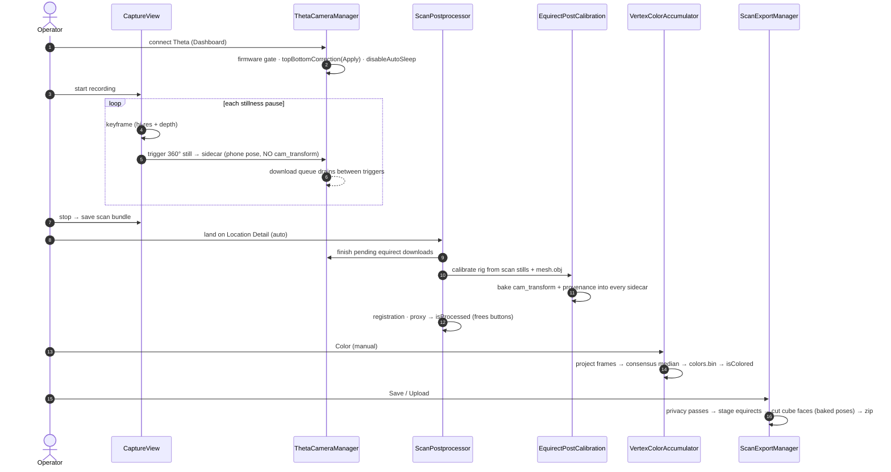
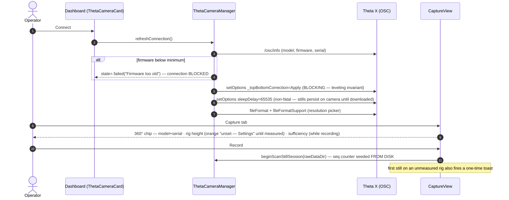
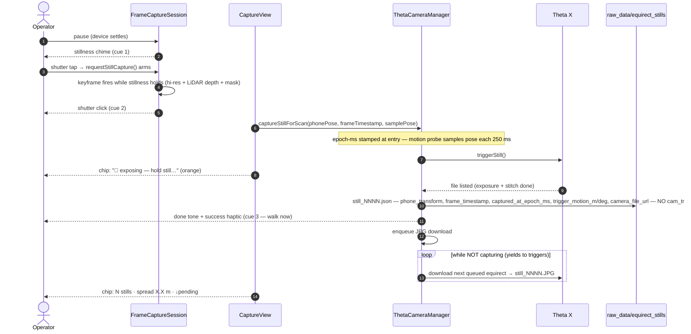
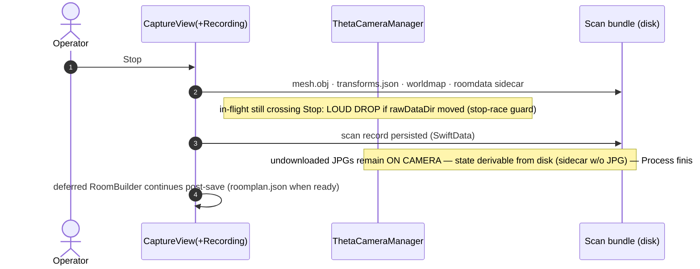
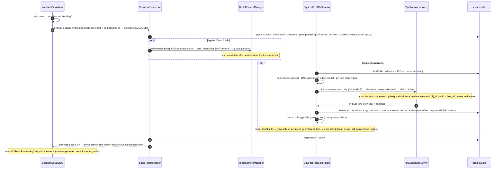
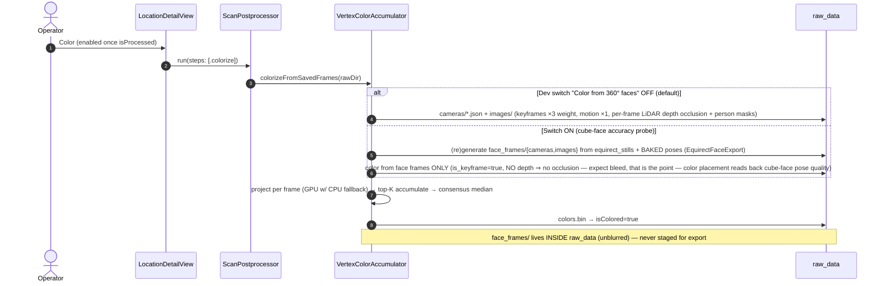
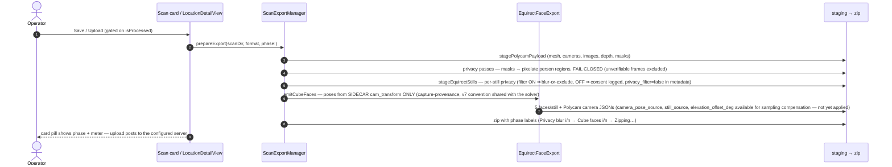

# 360° Still Source — Flows & Sequence Diagrams (post-pivot)

Companion to [still-source-360.md](still-source-360.md). This documents the flows **as
implemented after the post-process-calibration pivot** (2026-07-31, solver v7). Every
participant name below is a real type; every message is a real call or observable state
change. Cross-cutting invariants these flows must preserve:

- **Privacy fail-closed**: nothing captured leaves the device unverified; raw
  `equirect_stills/` and any face frames derived from them stay inside `raw_data/`
  (commit-blocked by the privacy guard) and only exit via the export privacy passes.
- **Sidecar-derived state**: equirect download/bake state lives ON DISK (sidecar present
  + JPG missing = pending download; `rig_calibration_source` + `..._solver_version`
  stamp = baked). No separate queue store to desync; version bumps self-heal old scans.
- **Poses bake at Process time** from the scan's own stills against the complete mesh;
  capture records only phone pose + timestamps (boot-relative `frame_timestamp` labeled,
  wall-clock `captured_at_epoch_ms`; metric everywhere — CONTRIBUTING → Units & time).
- **Yaw and elevation-offset are per-scan nuisances** (Theta re-derives its stitch
  reference; mounts sag); dy anchors to the user-measured rig height; dLat/pitch solve
  free inside mechanical bounds.

## 1. Overview — major sections

## 2. Detailed flows

### 2.1 Startup / start capture

### 2.2 AR/VR capture (per stillness pause)

### 2.3 Stop / save

### 2.4 Auto post-process (on landing at Location Detail)

### 2.5 Colorize (manual)

### 2.6 Export / save / upload

## Diagram maintenance

These diagrams are hand-drawn against the code as of solver v7. When a flow changes,
update the diagram in the same PR — the review checklist item is "does the mermaid still
tell the truth?". Names in diagrams are grep-able anchors on purpose.
